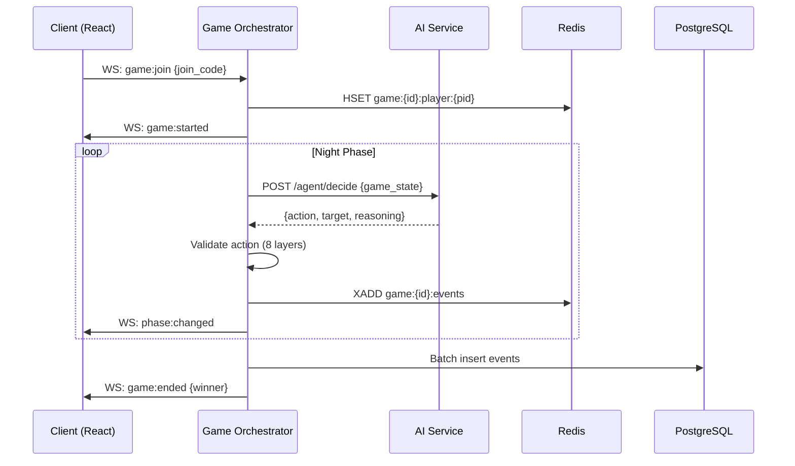

## Executive Summary

### Platform Vision

The Werewolf Game Platform is a multiplayer social deduction system supporting human players, AI bots, and LLM-powered agents in hybrid and fully autonomous configurations. Built on a polyglot microservices architecture — Node.js for real-time game orchestration, Python/FastAPI for AI agent reasoning, Redis plus PostgreSQL for state persistence — the platform simultaneously addresses three market needs: a competitive multiplayer game, a research infrastructure for social AI benchmarking, and a content generation engine for AI-only tournament simulations [^47^][^264^].

The design rests on ten research-validated insights. The most consequential is that deception scales faster than detection: the WOLF benchmark documents a 93% truth-speaking rate versus only 10% fabricated claim detection [^337^], and werewolves deceive in 31% of turns while peer detection achieves merely 71–73% precision [^151^]. Rather than fighting this asymmetry, the platform leverages it as a built-in difficulty progression — early AI agents are convincing liars but poor lie detectors, creating natural skill advancement for both agents and human players. A second insight drives the architecture: event sourcing for game state unlocks three distinct product features — replay, training data generation, and real-time spectator streaming — from a single architectural decision, making it the highest-ROI choice in the system [^172^][^209^].

The platform distinguishes itself through four capabilities no alternative provides simultaneously: (1) a three-tier AI agent system with dynamic complexity routing that reduces LLM costs by 70–86% while preserving strategic depth [^167^][^172^]; (2) ELO-based matchmaking that doubles as an AI evaluation benchmark [^35^]; (3) AI-only simulation at accelerated speed generating 25+ behavioral metrics per game with LLM-as-a-Judge evaluation; and (4) a declarative rules engine enabling new game modes without server redeployment.

### Core Capabilities

**Real-time multiplayer lobbies** support 6–16 players per match with WebSocket communication via Socket.IO, achieving p99 latency below 50 ms [^20^]. Four matchmaking modes — Quick, Ranked, Custom, and Tournament — cover the spectrum from casual 60-second queues to structured seasonal competition. The lobby system implements automatic AI backfill when human counts fall below mode minima, with bot difficulty calibrated to lobby average ELO [^429^][^430^].

**Role system and balance framework** provide 12+ roles from the Ultimate Werewolf character value system [^172^], with a mathematically grounded balance formula $b = 1 - |2 \cdot p_{imp} - 1|$ targeting $b > 0.75$ [^14^]. Three validated presets — 8-player Classic, 12-player Extended, and 6-player Quick Play — provide one-click balanced configurations, while a custom setup framework with real-time balance validation supports host-defined configurations.

**AI agent system** implements three capability tiers: Tier 1 (rule-based FSM, sub-millisecond latency, zero cost), Tier 2 (OCEAN personality-driven agents with ReCon theory-of-mind reasoning, ~10 ms latency), and Tier 3 (full LLM-powered agents with GRPO-trained persuasion, 0.5–5 s latency) [^127^][^179^][^248^]. Dynamic tier routing assigns complexity-appropriate tiers per decision, achieving an 86% cost reduction from $2.30 to $0.31 per game at eight LLM agents [^167^].

**Simulation and analytics infrastructure** runs AI-only games at accelerated speed, collecting 25+ behavioral metrics per player per game, evaluating agent performance through LLM-as-a-Judge across five dimensions, and feeding results into a data flywheel that continuously improves training data and agent prompts.

| Capability | Human-Only | Mixed Human-AI | AI Simulation | Source |
|:---|:---|:---|:---|:---|
| Players per match | 6–16 | 6–16 (1–8 AI) | 6–16 (all AI) | Ch. 3, Ch. 7 |
| LLM cost per game | $0.00 | ~$0.15 | ~$0.31 (optimized) | Ch. 2 [^167^] |
| Average match duration | 25–35 min | 25–35 min | 5–10 min (accelerated) | Ch. 7 |
| Matchmaking modes | All 4 modes | All 4 modes | Tournament only | Ch. 7 |
| ELO tracking | Per-role + overall | Per-role + overall | Agent benchmarking | Ch. 7 [^35^] |
| Behavioral metrics | Basic (win/loss) | Basic | 25+ per player | Ch. 8 |
| Content generation | Player-driven | Player-driven | Auto-clipped highlights | Ch. 8 |

The cost structure creates a sharp economic hierarchy: human-only games incur negligible LLM cost, mixed games with 1–2 AI agents cost ~$0.15 per match, and full AI simulation at 1,000 games/day costs $310/day optimized — a tenfold differential informing the three-tier subscription model [^167^].

### Architecture Overview

The polyglot backend separates real-time game logic from AI reasoning and persistent analytics through defined protocol boundaries. Node.js handles WebSocket connections and the 15-state finite state machine driving phase transitions. Python/FastAPI handles LLM inference orchestration through a stateless HTTP endpoint with 5-second timeout. Redis serves as hot state store and pub/sub broker with sub-millisecond operations [^17^]. PostgreSQL persists normalized game records and ELO ratings. ClickHouse (optional at medium scale) stores time-series behavioral aggregates [^267^].


The cost optimization architecture achieves the 86% reduction through five complementary techniques: response caching, model routing to cheaper models for simple decisions, context compaction via semantic summarization, cascading retries that attempt cheaper tiers before escalation, and prefix caching for static system prompt components [^167^][^172^][^174^].


Event sourcing is the foundational pattern enabling the platform's threefold product leverage. Every player action, phase transition, vote, chat message, and agent decision is recorded as an immutable append-only event. The current game state is a pure function of all events from sequence 0 to $n$, simultaneously enabling deterministic replay for anti-cheat verification, labeled training data generation, and real-time analytics streaming [^172^][^209^].

### AI Agent Architecture

The three-tier agent system addresses the latency-cost-quality tradeoff in LLM-powered gaming. Tier 1 agents execute hardcoded finite state machines with Werewolf-specific heuristics — random valid night targets, bandwagon voting at 60% consensus, defensive silence below 30% estimated survival — producing sub-millisecond responses at zero API cost. Tier 2 agents modulate Tier 1 outputs through Big Five (OCEAN) personality trait vectors, producing probabilistic decisions with ~10 ms latency [^179^][^248^]. Tier 3 agents deploy full LLM reasoning with GRPO-trained persuasion optimization [^127^][^346^].

| Tier | Core Logic | Latency | Cost/Game | Strategic Depth | Fallback |
|:---|:---|:---|:---|:---|:---|
| Tier 1: Rule-Based | FSM + heuristics [^205^] | <1 ms | $0.00 | Low | Base tier |
| Tier 2: Personality | OCEAN traits + belief matrix [^179^] | ~10 ms | ~$0.001 | Medium | LLM timeout |
| Tier 3: LLM-Powered | Full LLM + GRPO persuasion [^127^] | 0.5–5 s | $0.01–$0.30 | High | → Tier 2 |

The unified agent interface follows a four-phase lifecycle — observe, decide, act, speak — presenting an identical API contract to the Game Orchestrator regardless of the cognitive machinery behind it. The neuro-symbolic hybrid architecture, embedding decision trees as callable oracles within the LLM reasoning loop, achieves +7.2% entailment consistency and +5.3% multi-step accuracy over pure LLM approaches [^205^].

### Development Roadmap

The 24-week implementation follows four overlapping phases. Phase 1 (Weeks 0–6) delivers foundational architecture — Game Orchestrator, WebSocket infrastructure, Redis state management, core FSM, basic roles — producing a playable MVP. Phase 2 (Weeks 4–14) integrates the AI Service, implements all three agent tiers, builds chat and moderation, and establishes hybrid modes. Phase 3 (Weeks 10–18) develops ranked matchmaking with ELO, the simulation engine, analytics pipeline, and spectator mode. Phase 4 (Weeks 16–24) focuses on polish, accessibility, performance, and public release [^481^].


The team comprises six full-time equivalents: two backend engineers (Node.js), one AI engineer (Python/LLM), one frontend engineer (React), one DevOps engineer, and one product designer. Key risks include LLM API latency variability (mitigated by three-tier fallback), WebSocket scaling beyond 10,000 connections (mitigated by Redis adapter HPA) [^208^], and AI response quality consistency (mitigated by structured output schemas).

### Document Guide

This design document comprises ten technical chapters plus this Executive Summary and Appendix. Chapters 1–3 cover system foundations: architecture, AI framework, and game loop. Chapters 4–6 address player-facing systems: roles, communication, and UI. Chapters 7–8 specify modes, matchmaking, and simulation. Chapters 9–10 cover analytics and implementation planning.

| Chapter | Title | Key Decisions |
|:---|:---|:---|
| 1 | System Architecture | Polyglot backend, event sourcing, CQRS persistence |
| 2 | AI Player Framework | 3-tier agents, OCEAN personality, GRPO training, cost optimization |
| 3 | Game Loop & Phase Management | 15-state FSM, night resolution pipeline, timer system |
| 4 | Roles & Meta Design | 12+ roles, balance formula, deception-detection asymmetry |
| 5 | Chat & Communication System | 6 channels, 12 message types, 4-tier moderation (94.3% accuracy) |
| 6 | UI/UX, Animations & Visual Effects | Dark fantasy theme, 14 animations, WCAG 2.1 AA |
| 7 | Game Modes & Customization | 3 standard modes, 4 matchmaking modes, per-role ELO tracking |
| 8 | Simulation & Tournament System | Batch AI tournaments, 25+ metrics, LLM-as-a-Judge, data flywheel |
| 9 | Analytics & Data Pipeline | Real-time + batch pipelines, A/B testing, GDPR compliance |
| 10 | Implementation Roadmap | 24-week schedule, 6-person team, risk matrix with mitigations |

---

## Appendix: Reference Materials

### A.1 API Reference

#### A.1.1 WebSocket API

The Game Orchestrator exposes a Socket.IO namespace `/game` with bidirectional message flow. All messages use JSON framing with mandatory fields: `event_type` (string), `payload` (object), `timestamp` (ISO 8601), and `sequence_num` (integer). Authentication uses JWT bearer tokens in the connection handshake `auth` field. A 30-second heartbeat ping/pong detects stale connections; clients missing three consecutive pongs are flagged disconnected and enter a 30-second grace period [^48^].

| Event Name | Direction | Payload Schema | Validation |
|:---|:---|:---|:---|
| `game:join` | C→S | `{ game_id: string, join_code?: string }` | JWT required |
| `game:started` | S→C | `{ game_id: string, roles_assigned: boolean }` | Server-signed |
| `game:ended` | S→C | `{ game_id: string, winner: string, role_reveals: object }` | Server-signed |
| `phase:changed` | S→C | `{ from, to: string, round: number, timer_ms: number }` | Server-signed |
| `phase:ack` | C→S | `{ player_id: string, phase: string }` | JWT + phase match |
| `werewolf:select_target` | C→S | `{ target_id: string }` | Role + alive + phase |
| `seer:investigate` | C→S | `{ target_id: string }` | Role + alive + phase |
| `bodyguard:protect` | C→S | `{ target_id: string }` | Role + alive + phase |
| `vote:cast` | C→S | `{ target_id: string }` | Phase + alive |
| `vote:tallied` | S→C | `{ eliminated_id: string, vote_counts: object }` | Server-signed |
| `chat:send` | C→S | `{ channel: string, content: string }` | Channel permission |
| `chat:message` | S→C | `{ sender_id, channel, content, timestamp: number }` | Server-signed |
| `system:error` | S→C | `{ code: string, message: string, recoverable: boolean }` | Server-signed |

C→S messages pass through an eight-layer validation pipeline: connection authentication, game membership, alive status, phase validation, role validation, target validation, rate limiting, and anomaly detection [^190^]. Messages failing any layer receive a `system:error` response. S→C messages carry a server signature HMAC to prevent tampering.

#### A.1.2 AI Service REST API

The AI Service exposes three stateless endpoints. All accept and return JSON; the service maintains no state between requests.

| Endpoint | Method | Request Body | Response Body | Timeout |
|:---|:---|:---|:---|:---|
| `/agent/init` | POST | `{ agent_id, tier, personality?, role }` | `{ status, agent_id, tier_assigned }` | 5 s |
| `/agent/decide` | POST | `{ agent_id, game_state, phase, timeout_ms }` | `{ action, target?, reasoning, statement?, tier_used }` | 5 s |
| `/agent/speak` | POST | `{ agent_id, game_state, context, channel }` | `{ content, tone, intent, confidence }` | 5 s |

The `/agent/decide` endpoint is the primary integration point. The Game Orchestrator calls it during every phase requiring agent input. The `game_state` field contains the complete visible state for that agent, and the response contains a structured action that the Orchestrator validates before applying. The `tier_used` field enables cost tracking and quality assessment.

#### A.1.3 Message Flow Architecture



### A.2 Glossary

| Term | Definition | Context |
|:---|:---|:---|
| **A2A** | Agent-to-Agent protocol; structured communication standard enabling AI agents to exchange information and coordinate actions | AI Framework (Ch. 2) |
| **Alpha Werewolf** | Werewolf role appearing innocent to Seer checks; primary Seer counterplay | Roles (Ch. 4) |
| **Authoritative Server** | Architecture where the server is the sole source of truth for all game state [^21^] | Architecture (Ch. 1) |
| **Balance Index** | Formula $b = 1 - \|2 \cdot p_{imp} - 1\|$; target $b > 0.75$ [^14^] | Role Design (Ch. 4) |
| **CQRS** | Command Query Responsibility Segregation; separates write-optimized hot storage from read-optimized analytical storage | Architecture (Ch. 1) |
| **Event Sourcing** | Pattern where state derives from immutable event sequences [^209^] | Architecture (Ch. 1) |
| **FSM** | Finite State Machine; the 15-state phase management engine | Game Loop (Ch. 3) |
| **GRPO** | Group Relative Policy Optimization; RL method for training persuasion/deception [^75^] | AI Framework (Ch. 2) |
| **K-Factor** | ELO sensitivity parameter; 40 (Bronze) down to 12 (Master) [^481^] | Matchmaking (Ch. 7) |
| **LLM-as-a-Judge** | LLM-based evaluation scoring agents across 5 dimensions | Simulation (Ch. 8) |
| **Night Resolution** | Ordered 6-category pipeline processing all night actions [^10^] | Game Loop (Ch. 3) |
| **OCEAN** | Big Five personality model; drives Tier 2 behavior modulation [^179^] | AI Framework (Ch. 2) |
| **Parity Win** | Werewolf victory when living wolves equal or exceed living villagers | Game Rules (Ch. 4) |
| **Polyglot Backend** | Multi-language architecture (Node.js + Python) using best-fit runtimes | Architecture (Ch. 1) |
| **ReCon** | Recursive Contemplation; dual-perspective reasoning framework [^346^][^81^] | AI Framework (Ch. 2) |
| **SME** | Simple Multiplayer Elo; rating algorithm per faction [^418^] | Matchmaking (Ch. 7) |
| **Soft Tell** | Behavioral indicator suggesting a role without mechanical proof | Roles (Ch. 4) |
| **ToM** | Theory of Mind; modeling other agents' beliefs and intentions | AI Framework (Ch. 2) |
| **Ultimate Werewolf** | Published role system providing character value weights [^172^] | Role Design (Ch. 4) |

### A.3 Example Messages

#### A.3.1 WebSocket Action Message: Werewolf Night Kill Vote

```json
{
  "event_type": "werewolf:select_target",
  "payload": {
    "target_id": "player_7b3a9f",
    "reasoning": "Player 7 has been consistently quiet and voted against a confirmed villager in Round 2 — matching defensive wolf play."
  },
  "timestamp": "2025-01-15T21:34:18.247Z",
  "sequence_num": 47,
  "metadata": {
    "player_id": "player_2c8e1d",
    "role": "WEREWOLF",
    "round": 2,
    "phase": "WW_SELECT",
    "tier_used": 3,
    "llm_model": "claude-sonnet-4-20250514",
    "inference_ms": 1247,
    "cost_usd": 0.0031
  }
}
```

The `metadata` block is stripped before broadcasting to other werewolves and appended to the event log for replay and cost tracking. The `reasoning` field is stored server-side for LLM-as-a-Judge evaluation but never exposed to other players.

#### A.3.2 AI Service Request and Response

The following request is sent from the Game Orchestrator to `POST /agent/decide` during Day Discussion. The AI Service maintains no session state — every call carries complete game context.

```json
{
  "agent_id": "agent_gpt4o_17",
  "game_state": {
    "self": { "player_id": "p_17", "role": "SEER", "faction": "VILLAGE", "is_alive": true },
    "phase": "DAY_DISCUSS", "round": 3, "timer_remaining_ms": 45000,
    "alive_players": [
      {"id": "p_12", "name": "Player 12"},
      {"id": "p_17", "name": "Player 17 (You)"},
      {"id": "p_03", "name": "Player 3"},
      {"id": "p_08", "name": "Player 8"}
    ],
    "dead_players": [
      {"id": "p_05", "role_revealed": "VILLAGER", "death_cause": "NIGHT_KILL"},
      {"id": "p_19", "role_revealed": "WEREWOLF", "death_cause": "VOTE_EXECUTION"}
    ],
    "investigation_results": [
      {"target_id": "p_03", "result": "NOT_WOLF", "night": 1},
      {"target_id": "p_08", "result": "NOT_WOLF", "night": 2}
    ],
    "chat_history": [
      {"sender": "p_12", "content": "p03 looks suspicious for being too quiet"},
      {"sender": "p_21", "content": "p12 is pushing hard, maybe wolf trying to frame?"}
    ]
  },
  "phase": "DAY_DISCUSS",
  "timeout_ms": 5000
}
```

Expected constrained JSON response:

```json
{
  "action": "SPEAK",
  "reasoning": "p03 and p08 are cleared by my investigations. p12 pushing suspicion on a cleared player is highly suspicious wolf behavior.",
  "statement": "I'm the Seer. p03 (Night 1) and p08 (Night 2) are both NOT wolves. p12 is trying to lynch a cleared villager. We should vote p12.",
  "vote_intent": "p_12",
  "tier_used": 3,
  "confidence": 0.87
}
```

The Game Orchestrator validates `vote_intent` against the current voting state before accepting it.

#### A.3.3 Event Log Entry: Complete Vote Cast Event

```json
{
  "event_id": "01JJ4N8XQW3B9Z1VFT2K9D8RJ",
  "game_id": "game_a7b2c3d4",
  "type": "VOTE_CAST",
  "timestamp": 1705355658247,
  "round": 3,
  "phase": "VOTING",
  "payload": {
    "voter_id": "p_17",
    "target_id": "p_12",
    "vote_number": 7,
    "previous_vote": "p_21"
  },
  "metadata": {
    "player_id": "p_17",
    "client_timestamp": 1705355658198,
    "server_version": "1.3.2",
    "validation_passed": true,
    "processing_time_ms": 3
  }
}
```

Events flow through three storage tiers: Redis Stream (`game:{id}:events`, 24-hour TTL) for hot game state, PostgreSQL for persistent partitioned storage, and ClickHouse for time-series analytics. The triple-write pattern ensures each storage system uses media optimized for its access pattern without cross-interference.

### A.4 Configuration Reference

#### A.4.1 Environment Variables and Game Constants

| Variable | Service | Default | Description | Validation |
|:---|:---|:---|:---|:---|
| `GAME_ORCH_PORT` | Game Orchestrator | `3000` | HTTP/WebSocket listen port | 1024–65535 |
| `AI_SERVICE_URL` | Game Orchestrator | `http://localhost:8000` | AI Service HTTP endpoint | Valid URL |
| `AI_TIMEOUT_MS` | Game Orchestrator | `5000` | Maximum AI decision wait | 1000–30000 |
| `LLM_DEFAULT_MODEL` | AI Service | `gpt-4o` | Primary LLM provider | gpt-4o, claude-sonnet, gpt-4o-mini |
| `LLM_FALLBACK_MODEL` | AI Service | `gpt-4o-mini` | Fallback on timeout/error | gpt-4o-mini, gpt-3.5-turbo |
| `REDIS_URL` | All | `redis://localhost:6379` | Redis cluster connection | Valid redis:// URL |
| `REDIS_GAME_TTL_SEC` | Game Orchestrator | `14400` | Game state key TTL (4 h) | 3600–86400 |
| `POSTGRES_URL` | All | — | PostgreSQL connection DSN | Required |
| `CLICKHOUSE_URL` | Analytics | — | ClickHouse (optional) | clickhouse:// or empty |
| `JWT_SECRET` | All | — | HMAC secret for token signing | Min 32 characters |
| `JWT_EXPIRY_HOURS` | All | `24` | Token validity duration | 1–168 |
| `RATE_LIMIT_REQ_PER_MIN` | Game Orchestrator | `60` | Per-IP rate limit | 10–600 |
| `MAX_CONCURRENT_GAMES_PER_POD` | Game Orchestrator | `8` | HPA scaling threshold | 1–50 |
| `SIMULATION_SPEED_MULTIPLIER` | AI Service | `10` | AI-only acceleration factor | 1–100 |
| `GRPO_TRAINING_ENABLED` | AI Service | `false` | GRPO persuasion training | Boolean |

| Constant | Default | Rationale | Source |
|:---|:---|:---|:---|
| Day timer $T_{day}$ | 90 s | Standard discussion duration | Ch. 7 |
| Night timer $T_{night}$ | 60 s | Time for all roles to submit actions | Ch. 7 |
| Min/max players | 6 / 16 | Meaningful faction distribution / practical limit | Ch. 3 [^44^] |
| Werewolf ratio bounds | 2.5:1 – 4.5:1 | Balanced villager-to-wolf ratio | Ch. 4 |
| Balance weight tolerance | ±2 | Acceptable point-sum deviation | Ch. 4 [^172^] |
| ELO K-factor range | 40 (Bronze) – 12 (Master) | Decreasing sensitivity by skill tier | Ch. 7 [^481^] |
| ELO baseline | 1500 | Starting rating for new players | Ch. 7 |
| Bandwagon threshold $\theta_{bw}$ | 0.60 | Consensus fraction triggering heuristic | Ch. 2 |
| Self-preservation threshold $\theta_{sp}$ | 0.30 | Survival probability triggering defense | Ch. 2 |
| LLM context window max | 8192 tokens | Maximum compacted context size | Ch. 2 |
| Reconnection grace period | 30 s | Time before elimination on disconnect | Ch. 3 [^48^] |
| Simulation batch size | 100 | Parallel AI games per batch | Ch. 8 |

These constants are loaded at service startup and are immutable for in-progress games. Changes to balance-critical constants require restart and affect only games created after the change. The validation middleware rejects internally inconsistent configurations (e.g., $T_{night} > T_{day}$ or $N_{min} < 4$).
