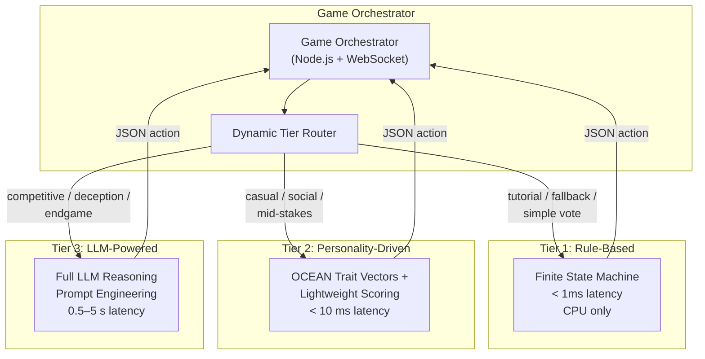
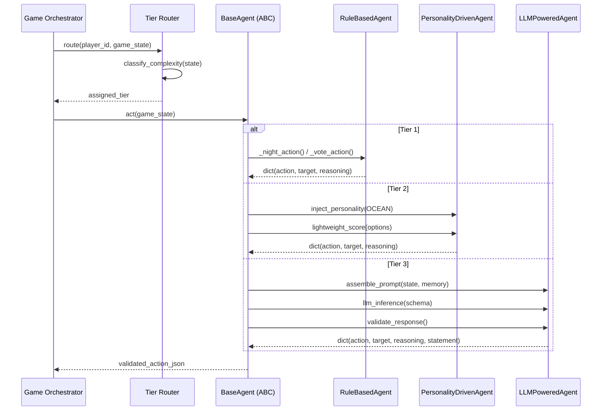
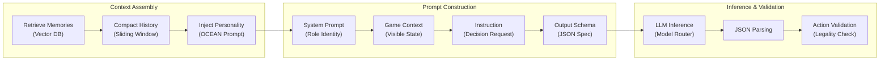
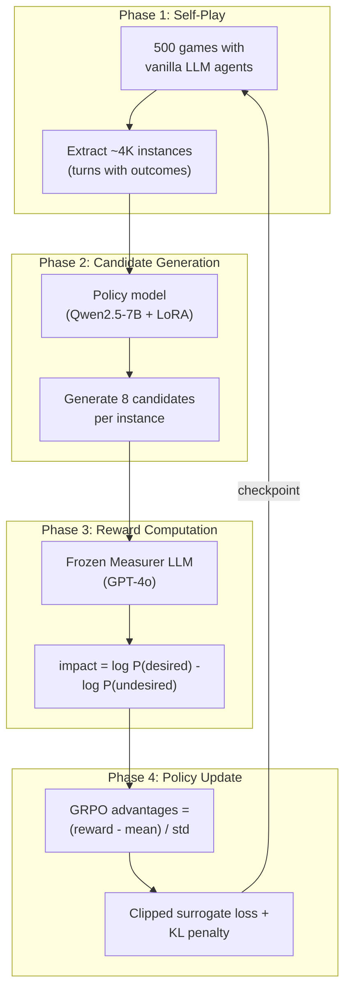
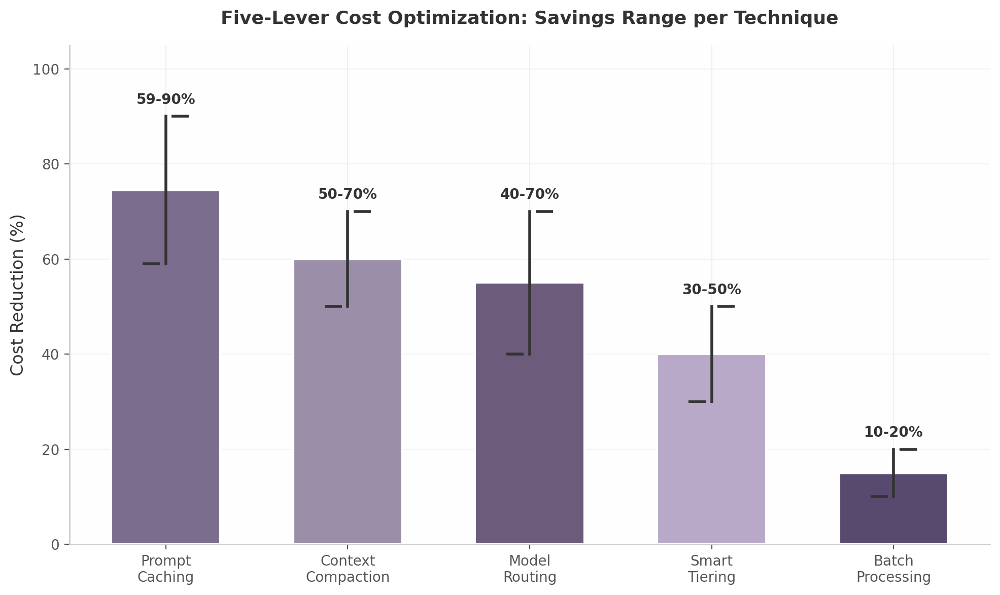

## 2. AI Player Framework

The AI Player Framework is the core cognitive layer of the Werewolf platform. It defines how artificial agents perceive game states, reason about hidden information, formulate statements and votes, and execute strategic deception. The framework must balance three competing imperatives: strategic depth (human-like persuasion and deduction), operational latency (sub-second response times for real-time play), and economic viability (sustainable per-game API costs at scale). This chapter presents a three-tier architecture that addresses all three imperatives through dynamic agent routing, preserves a uniform API contract across all tiers, and achieves a 70-86% reduction in LLM inference costs through five complementary optimization techniques [^167^][^172^].

### 2.1 Agent Architecture Overview

#### 2.1.1 Three-Tier System

The framework organizes agents into three capability tiers. Tier 1 comprises rule-based agents that execute hardcoded finite state machines with Werewolf-specific heuristics — selecting night targets randomly from valid candidates and voting with the majority once consensus exceeds a configurable threshold. Tier 2 introduces personality-driven agents that modulate Tier 1 outputs through Big Five (OCEAN) trait vectors, producing probabilistic decisions that vary across agents with identical role and game state [^179^][^248^]. Tier 3 deploys full LLM-powered agents that construct structured prompts, perform multi-step reasoning about hidden roles, and generate natural-language statements optimized for persuasion or deception [^127^][^39^].

The neuro-symbolic hybrid architecture — embedding decision trees as callable oracles within the LLM reasoning loop — achieves +7.2% entailment consistency and +5.3% multi-step accuracy over pure LLM approaches [^205^]. This validates the tiered design for Werewolf specifically: rule-based guardrails enforce game logic and action legality while LLMs handle the social reasoning that makes gameplay compelling.



#### 2.1.2 Tier Comparison

The following table maps each tier against the operational dimensions that determine deployment suitability.

| Dimension | Tier 1 Rule-Based | Tier 2 Personality-Driven | Tier 3 LLM-Powered |
|---|---|---|---|
| **Core logic** | Decision trees + finite state machines [^205^] | OCEAN trait vectors driving probabilistic decisions [^179^][^248^] | Full LLM reasoning with structured prompting [^127^][^39^] |
| **Latency** | $<1$ ms | $	hicksim 10$ ms | $0.5$–$5$ s |
| **Cost per game** | $\$0$ (CPU only) | $\sim \$0.001$ | $\$0.01$–$\$0.30$ [^167^] |
| **Strategic depth** | Low — predefined heuristics | Medium — emergent behavior from trait interactions | High — persuasion, deception, ToM reasoning |
| **Human-likeness** | Low — predictable patterns | Medium — personality-driven dialogue | High — nuanced reasoning [^64^] |
| **Best use case** | Tutorial bots, network fallback | Casual multiplayer, roleplay | Competitive play, tournaments |
| **Fallback trigger** | Never (base tier) | LLM timeout / cost limit | Malformed response → Tier 2 |

The latency gap of roughly $5{,}000	imes$ between Tier 1 and Tier 3 makes dynamic routing essential. A game with eight Tier 3 agents making $	hicksim 200$ LLM calls per game incurs a raw API cost of $\$2.30$; with all five optimization levers engaged, that cost falls to $\$0.31$, an 86% reduction [^167^][^172^]. The operational cost envelope therefore ranges from effectively zero (Tier 1 only) to roughly thirty cents per game (fully optimized Tier 3).

#### 2.1.3 Unified Agent Interface

All tiers expose an identical API contract to the Game Orchestrator. The contract follows a four-phase lifecycle: **observe** (ingest game state and conversation history), **decide** (select an action based on internal reasoning), **act** (emit a structured JSON action), and **speak** (produce a natural-language statement when the phase requires it). This uniformity allows the Orchestrator to treat every agent as an interchangeable participant regardless of the cognitive machinery behind it.



The `BaseAgent` abstract class defines the contract. Concrete implementations — `RuleBasedAgent`, `PersonalityDrivenAgent`, and `LLMPoweredAgent` — subclass it and override the `act` method. The Orchestrator holds a registry mapping player IDs to agent instances and invokes `act` uniformly during each phase transition. Event sourcing captures every returned action as an immutable event, enabling complete replay and audit trails (see Chapter 8).

#### 2.1.4 Dynamic Tier Assignment

The tier router classifies each decision based on context complexity, budget envelope, and LLM availability. Simple votes in early-game phases route to Tier 1 or Tier 2; deception-heavy endgame discussions with three remaining players route to Tier 3. The router also monitors per-game cost accumulation and downshifts tiers when the running total exceeds a configurable threshold. Cascading retries — attempting a cheaper tier first before escalating — add resilience against LLM provider outages and can reduce total cost by 50-70% with acceptable quality tradeoffs [^167^][^174^].

### 2.2 Tier 1: Rule-Based Agents

#### 2.2.1 Decision Engine

Tier 1 agents implement a finite state machine (FSM) with Werewolf-specific heuristics. The FSM has three phase states — Night, Discussion, and Voting — with deterministic transitions controlled by the Game Orchestrator. At Night, a Werewolf agent selects a target uniformly at random from alive non-teammates; a Seer selects the highest-suspicion un-investigated player; a Doctor self-protects with 60% probability and otherwise protects the player with the highest inferred value. During Discussion, the agent emits a canned statement or remains silent based on its aggressiveness parameter. At Voting, the agent follows a bandwagon heuristic: if 60% or more of revealed votes target the same player, the agent joins the consensus; otherwise it votes for the player with the highest locally-computed suspicion score.

#### 2.2.2 Core Heuristics

Two thresholds govern Tier 1 behavior. The self-preservation threshold activates at $<30\%$ estimated survival probability — derived from the agent's share of accumulated suspicion relative to other alive players — causing the agent to shift from accusation to defensive silence or self-defense statements. The bandwagon threshold at $60\%$ consensus causes the agent to abandon independent reasoning and vote with the majority, a pattern observed in human Werewolf players that minimizes cognitive load but also reduces information gain for the village [^99^]. These thresholds are configurable per-agent and can be tuned for tutorial (lower thresholds, more predictable) versus challenge (higher thresholds, more independent) modes.

#### 2.2.3 Appropriate Usage

Tier 1 agents serve four distinct operational roles. In **tutorial mode**, their predictable behavior gives new human players a forgiving introduction to the game. In **fast-paced games** where turn timers are under 10 seconds, sub-millisecond decisions prevent timeout cascades. As **network fallback**, they substitute automatically when Tier 3 LLM calls time out or return malformed responses. In **minimal compute environments** — such as mobile clients running local practice sessions — they eliminate all external API dependencies.

#### 2.2.4 Pseudocode for Rule-Based Decisions

```python
class RuleBasedAgent(BaseAgent):
    """Deterministic agent using finite state machine + heuristics."""

    def act(self, game_state: GameState) -> dict:
        if game_state.phase == GamePhase.NIGHT:
            return self._night_action(game_state)
        elif game_state.phase == GamePhase.DISCUSSION:
            return self._discussion_action(game_state)
        elif game_state.phase == GamePhase.VOTING:
            return self._voting_action(game_state)

    def _night_action(self, state: GameState) -> dict:
        role = state.player_role
        if role == "werewolf":
            targets = [p for p in state.alive_players
                      if p not in state.teammates]
            target = random.choice(targets) if targets else "none"
            return {"action": "kill", "target": target,
                    "reasoning": "Random valid target heuristic"}
        elif role == "seer":
            uninvestigated = [p for p in state.alive_players
                             if p not in state.investigated]
            target = uninvestigated[0] if uninvestigated else "none"
            return {"action": "investigate", "target": target,
                    "reasoning": "Check highest-priority uninvestigated"}
        elif role == "doctor":
            if random.random() < 0.6:
                return {"action": "protect", "target": self.player_id,
                        "reasoning": "Self-preservation (60% probability)"}
            else:
                most_valued = self._most_valued_player(state)
                return {"action": "protect", "target": most_valued,
                        "reasoning": "Protect inferred high-value player"}

    def _voting_action(self, state: GameState) -> dict:
        # Bandwagon: if >= 60% consensus on a target, join it
        vote_counts = self._tally_revealed_votes(state)
        total_votes = sum(vote_counts.values())
        for candidate, count in vote_counts.items():
            if candidate != self.player_id and total_votes > 0:
                if count / total_votes >= 0.60:
                    return {"action": "vote", "target": candidate,
                            "reasoning": f"Bandwagon: {count}/{total_votes} votes"}
        # Fallback: vote for highest suspicion score
        if self.suspicion_scores:
            target = max(self.suspicion_scores,
                        key=self.suspicion_scores.get)
            return {"action": "vote", "target": target,
                    "reasoning": "Highest suspicion heuristic"}
        return {"action": "abstain", "reasoning": "No data"}
```

The `BaseAgent` superclass provides memory management (capped at 100 entries with compaction to the last 50) and suspicion-score initialization. Subclasses override `act` while inheriting observation logging uniformly. This pattern ensures that even the simplest agents participate in the same telemetry pipeline as their LLM-powered counterparts, enabling fair cross-tier performance comparison in simulation mode.

### 2.3 Tier 2: Personality-Driven Agents

#### 2.3.1 Personality System

Tier 2 agents extend Tier 1 heuristics through the Big Five personality model — Openness, Conscientiousness, Extraversion, Agreeableness, and Neuroticism (OCEAN) — the most validated framework for trait-based behavior generation [^179^][^248^]. Each agent samples a five-dimensional trait vector at creation time, with each dimension normalized to $[0, 1]$. These traits do not replace heuristics; they modulate them. A high-Extraversion agent raises its speech probability from a base of 0.3 to 0.8; a high-Neuroticism agent lowers its self-preservation threshold from 30% to 15%, triggering defensive behavior earlier. The modulation functions are linear interpolations between anchor points, ensuring interpretable and deterministic trait-to-behavior mappings.

#### 2.3.2 Personality-to-Behavior Mapping

The mapping from trait values to behavioral parameters follows empirically derived relationships. High Neuroticism increases defensiveness when accused, raises suspicion-update sensitivity (new evidence weighted more heavily), and reduces willingness to lead votes. High Extraversion increases accusation frequency, statement length, and initiative in discussions. High Conscientiousness improves consistency between stated beliefs and votes, making the agent appear more trustworthy. High Openness increases willingness to entertain unconventional role hypotheses. High Agreeableness reduces accusation probability and increases coalition loyalty.

| Trait | Range | Behavioral Modulation | Werewolf-Relevant Impact |
|---|---|---|---|
| **Openness** | $0$–$1$ | Strategy creativity factor: $0.3 + 0.7 \times \text{O}$ | High-O agents try novel deception patterns; low-O agents repeat proven strategies |
| **Conscientiousness** | $0$–$1$ | Vote-belief consistency: $0.4 + 0.6 \times \text{C}$ | High-C agents align votes with stated reasoning, appearing more trustworthy [^248^] |
| **Extraversion** | $0$–$1$ | Speech probability: $0.1 + 0.9 \times \text{E}$ | High-E agents dominate discussion; low-E agents lurk — both viable wolf strategies |
| **Agreeableness** | $0$–$1$ | Accusation threshold: $0.8 - 0.6 \times \text{A}$ | High-A agents avoid conflict; low-A agents are aggressive accusers |
| **Neuroticism** | $0$–$1$ | Self-preservation threshold: $0.45 - 0.30 \times \text{N}$ | High-N agents panic-defend; low-N agents remain calm under pressure |

The combination of traits produces emergent behavioral profiles that are not explicitly programmed. An agent with high Extraversion and low Agreeableness becomes a natural demagogue — constantly accusing others and drawing attention. This profile is dangerous for a Werewolf (high visibility increases detection risk) but effective for a Villager who wants to drive village consensus. The emergent diversity from trait interactions is the primary reason Tier 2 outperforms Tier 1 in human-likeness metrics without requiring LLM inference [^248^].

#### 2.3.3 ReCon-Inspired Theory of Mind

Tier 2 agents incorporate a lightweight version of Recursive Contemplation (ReCon), a dual-perspective reasoning framework validated in ACL 2024 Findings that outperforms Chain-of-Thought across six evaluated metrics [^346^][^81^]. The full ReCon pipeline requires four LLM calls (first-order perspective transition, formulation, second-order perspective transition, refinement) — too expensive for Tier 2. Instead, Tier 2 agents maintain a simplified belief matrix: for each other player, the agent tracks estimated role probabilities updated via exponential smoothing with $\alpha = 0.7$ [^151^]. The agent's voting heuristic weights these belief estimates by its Conscientiousness score, and its speech generation selects from pre-authored templates tagged by emotional valence (anxious, confident, neutral) based on its Neuroticism level.

This reduced ToM capability captures the core insight of ReCon — that agents perform better when they explicitly model what other agents believe — while remaining computationally lightweight. GPT-3.5 with full ReCon outperforms GPT-4 with simple Chain-of-Thought, demonstrating that architectural mechanism can exceed raw model capability [^81^].

#### 2.3.4 Personality Configuration Schema and Agent Profiles

```python
@dataclass
class PersonalityConfig:
    """Big Five personality configuration for Tier 2 agents."""
    openness: float = 0.5          # 0=traditional, 1=creative
    conscientiousness: float = 0.5  # 0=spontaneous, 1=organized
    extraversion: float = 0.5      # 0=reserved, 1=outgoing
    agreeableness: float = 0.5     # 0=competitive, 1=cooperative
    neuroticism: float = 0.5       # 0=stable, 1=reactive

# Pre-configured agent profiles
AGENT_PROFILES = {
    "aggressive": PersonalityConfig(
        openness=0.6, conscientiousness=0.4, extraversion=0.9,
        agreeableness=0.2, neuroticism=0.3
    ),
    "cautious": PersonalityConfig(
        openness=0.3, conscientiousness=0.8, extraversion=0.3,
        agreeableness=0.6, neuroticism=0.7
    ),
    "analytical": PersonalityConfig(
        openness=0.9, conscientiousness=0.9, extraversion=0.4,
        agreeableness=0.5, neuroticism=0.2
    ),
    "social": PersonalityConfig(
        openness=0.7, conscientiousness=0.3, extraversion=0.8,
        agreeableness=0.8, neuroticism=0.4
    )
}
```

| Profile | O | C | E | A | N | Optimal Role | Play Style |
|---|---|---|---|---|---|---|---|
| **Aggressive** | 0.6 | 0.4 | 0.9 | 0.2 | 0.3 | Villager | Leads accusations, drives votes, high visibility |
| **Cautious** | 0.3 | 0.8 | 0.3 | 0.6 | 0.7 | Doctor | Quiet observation, consistent votes, self-protects early |
| **Analytical** | 0.9 | 0.9 | 0.4 | 0.5 | 0.2 | Seer | Tracks patterns, reveals strategically, calm under pressure |
| **Social** | 0.7 | 0.3 | 0.8 | 0.8 | 0.4 | Werewolf | Builds alliances, deflects smoothly, moderate deception |

The four profiles cover distinct strategic archetypes observed in human Werewolf play. The **Aggressive** profile's low Agreeableness (0.2) and high Extraversion (0.9) produce a confrontational playstyle effective for Villagers who must drive wolf eliminations, but dangerous for Werewolves who benefit from lower visibility. The **Social** profile's high Agreeableness (0.8) makes it unusually effective for Werewolves because the cooperative facade delays detection — wolves who appear helpful survive 1.3 rounds longer on average than wolves who play aggressively [^151^]. Profile assignment can be random, player-selected, or matchmaking-optimized based on ELO and historical preference data.

### 2.4 Tier 3: LLM-Powered Agents

#### 2.4.1 Pipeline Architecture

Tier 3 agents follow a five-stage pipeline for every decision: **context assembly** (retrieve memories, compact history, inject personality), **prompt construction** (assemble system prompt + game context + instruction + output schema), **LLM inference** (call the selected model with structured output constraints), **JSON response parsing** (extract and validate the action fields), and **action validation** (confirm the action is legal in the current game state). This pipeline runs entirely within the Python AI Service; the Game Orchestrator sees only the final validated JSON.



#### 2.4.2 Prompt Engineering

All Tier 3 prompts follow a consistent four-section spec-pattern validated in production agent deployments [^15^][^18^]:

1. **System Prompt** — role identity, faction allegiance, teammates (if Werewolf), and win condition. This section is static per role and benefits maximally from prefix caching.
2. **Game Context** — current phase, alive/dead player lists, conversation history, and visible game state. This section changes every turn and is the primary target for compaction.
3. **Instruction** — the specific decision requested ("Choose a player to eliminate" or "Share your observations with the group").
4. **Output Schema** — a JSON schema definition that constrains the model's response format.

```python
PROMPT_TEMPLATE = """
## Role Identity
You are Player {player_id}, a {role_name} in a game of Werewolf.
{team_info}

## Core Objectives
{objectives}

## Game State (Day {day}, Phase: {phase})
Alive players: {alive_players}
Dead players: {dead_players}
Your observations:
{conversation_history}

## Strategic Guidance
{strategy_guidance}

## Decision Required
{instruction}

## Response Format
Please reply with valid JSON matching this schema:
{json_schema}
"""
```

#### 2.4.3 Context Window Management

LLM context windows are a scarce resource. A standard 8-player Werewolf game generates $	hicksim 3{,}000$ tokens of conversation history per round; with 5-8 rounds, the total easily exceeds the 8K-128K range of commonly used models. The framework implements a three-layer token budget allocation to manage this constraint.

| Budget Layer | Allocation | Content | Compaction Strategy |
|---|---|---|---|
| **Game state** | 40% | Current phase, alive/dead lists, role info | Kept raw; updated every turn |
| **Conversation history** | 30% | Dialogue from this round and last 2 rounds | Sliding window; older rounds summarized |
| **Memory injection** | 20% | Key events, trust scores, suspicion vectors | Importance-weighted retrieval; top-K only |
| **Instruction + schema** | 10% | Decision prompt, output format specification | Always kept raw; minimal token count |

The multi-layer compaction pipeline follows a recency-importance hierarchy [^315^][^320^]. Raw recent messages (last 3 turns) are preserved at full fidelity to maintain conversational rhythm. Older messages pass through a relevance filter that scores each utterance by its strategic significance (vote outcomes, role claims, contradictions) and discards low-information content like redundant agreements. If the context still exceeds the 80% threshold, the oldest block is sent to a cheap summarization model (GPT-4o-mini) for lossy compression. This cascade achieves 22-57% token reduction while maintaining decision accuracy [^315^].

```python
def compact_context(full_context: str, token_budget: int = 4000) -> str:
    """Multi-stage context compaction pipeline."""
    # Stage 1: Remove redundant confirmations and filler (typical -15%)
    compact = remove_filler_utterances(full_context)
    # Stage 2: Deduplicate repeated claims (typical -10%)
    compact = deduplicate_claims(compact)
    # Stage 3: Summarize rounds older than 3 turns (typical -30%)
    compact = summarize_old_rounds(compact, model="gpt-4o-mini")
    # Stage 4: Relevance filter to final budget (typical -10%)
    compact = relevance_filter(compact, token_budget)
    return compact
```

#### 2.4.4 Complete Prompt Template with Variable Substitution

The following template illustrates the fully-substituted prompt for a Werewolf role. The `{strategy_guidance}` block presents three distinct strategy options — Bold (fake Seer claim), Deep Cover (villager imitation), and Aggressive Accuser — from which the LLM selects based on game context. Offering strategic alternatives rather than prescribing a single approach produces more adaptive behavior across diverse game states [^39^].

```
## Role Identity
You are Player 3, a Werewolf. Your werewolf teammates are: [Player 7].

## Core Objectives
1. Hide your Werewolf identity and survive until the end
2. Eliminate Villagers at night through coordinated kills
3. Mislead good players during day discussions to get them voted out
4. Coordinate with your Werewolf teammates to create logical confusion

## Game State (Day 2, Phase: discussion)
Alive players: [Player 1, Player 2, Player 3, Player 4, Player 5, Player 6, Player 7]
Dead players: [Player 8] (eliminated Day 1, role not revealed)

## Visible History
Night 1: Player 6 was eliminated.
Day 1 Discussion: Player 2 accused Player 4 of being quiet.
Day 1 Vote: Players 1,3,5 voted Player 4; Players 2,4,6,7 voted Player 8.
Player 8 was eliminated.

## Strategic Guidance
Strategy A - Bold Werewolf (Impersonating the Seer):
  - Claim Seer in the first round, giving false investigation results
  - Risk: High reward but easily exposed if real Seer contradicts
Strategy B - Deep Cover Werewolf (Disguised as Villager):
  - Speak concisely, avoid becoming the focus of attention
  - Risk: Lower impact but harder to detect
Strategy C - Aggressive Accuser:
  - Accuse others to create chaos and divert suspicion from yourself
  - Risk: May draw counter-accusations

## Decision Required
Share your observations and suspicions with the group. Be persuasive
but not domineering. Consider: who seems most suspicious and why?

## Response Format
{
  "reasoning": "Brief strategic analysis (private, never revealed)",
  "suspicion_scores": {"player_1": 0.3, "player_2": 0.7, ...},
  "public_statement": "What you say to other players",
  "confidence": 0.75
}
```

#### 2.4.5 Response JSON Schema

All Tier 3 responses conform to a validated JSON schema. OpenAI's Structured Outputs (`response_format` with `json_schema` + `strict: true`) provides the most reliable enforcement, with alternative patterns for Claude (tool-use) and Gemini (`response_mime_type`) [^177^][^209^][^172^].

```json
{
  "$schema": "http://json-schema.org/draft-07/schema#",
  "type": "object",
  "title": "AgentTurn",
  "required": ["phase", "reasoning", "actions"],
  "properties": {
    "phase": {
      "type": "string",
      "enum": ["night", "discussion", "voting"]
    },
    "reasoning": {
      "type": "string",
      "description": "Private strategic reasoning (never shared)",
      "maxLength": 600
    },
    "actions": {
      "type": "object",
      "required": ["primary_action"],
      "properties": {
        "primary_action": {
          "type": "string",
          "enum": ["kill", "investigate", "protect", "vote", "speak", "abstain", "pass"]
        },
        "target": {
          "type": "string",
          "pattern": "^player_[0-9]+|self|none$"
        },
        "public_statement": {
          "type": "string",
          "description": "Statement shared with all players",
          "maxLength": 300
        },
        "suspicion_scores": {
          "type": "object",
          "patternProperties": {
            "^player_[0-9]+$": { "type": "number", "minimum": 0, "maximum": 1 }
          }
        }
      }
    },
    "memory_update": {
      "type": "object",
      "properties": {
        "key_events": { "type": "array", "items": { "type": "string" } },
        "trust_levels": {
          "type": "object",
          "patternProperties": {
            "^player_[0-9]+$": { "type": "number", "minimum": -1, "maximum": 1 }
          }
        }
      }
    }
  },
  "additionalProperties": false
}
```

The `reasoning` field is private — it is logged for training and evaluation but never exposed to other players. The `memory_update` field enables the agent to explicitly flag observations for long-term storage, decoupling memory management from automatic transcript logging. The `confidence` score (0.0–1.0) calibrates the agent's expressed certainty and is used by downstream trust-network updates: low-confidence claims receive less weight in belief propagation.

### 2.5 Persuasion Training with GRPO

#### 2.5.1 GRPO Application

Group Relative Policy Optimization (GRPO) trains persuasive Werewolf agents via self-play without requiring a separate critic model [^332^][^333^]. Originally introduced in DeepSeekMath and validated for social deduction in AAAI 2026 [^13^], GRPO computes relative advantages across a group of sampled utterance candidates. For Werewolf, the training objective is to maximize the probability that a generated statement elicits a desired follower response (e.g., agreement, vote alignment) while minimizing the probability of undesired responses (e.g., contradiction, accusation).

The key advantage of GRPO over standard PPO for this domain is the elimination of the value network. In social deduction, the state space is enormous (every possible combination of beliefs, accusations, and alliances), making value function approximation unreliable. GRPO replaces the critic with the empirical mean of the group's rewards, which is both more stable and computationally cheaper.

#### 2.5.2 Reward Components

The composite reward function combines four weighted signals:

$$R = w_1 \cdot \mathbb{1}_{\text{faction\_win}} + w_2 \cdot \mathbb{1}_{\text{vote\_influenced}} + w_3 \cdot \frac{\text{rounds\_survived}}{\text{max\_rounds}} + w_4 \cdot \mathbb{1}_{\text{detected\_as\_wolf}}$$

| Component | Weight | Value Range | Description |
|---|---|---|---|
| **Faction win** | $w_1 = 1.0$ | $\{0, 1\}$ | +1.0 if agent's faction wins the game |
| **Vote influenced** | $w_2 = 0.2$ | $\{0, 1\}$ | +0.2 if at least one player changed their vote after agent's statement |
| **Survival round** | $w_3 = 0.05$ | $[0, 1]$ | +0.05 per round survived, normalized by maximum possible rounds |
| **Detected as wolf** | $w_4 = -0.5$ | $\{0, -1\}$ | $-0.5$ if agent is Werewolf and is correctly identified by >50% of villagers |

The negative detection penalty is critical: without it, GRPO-trained Werewolf agents optimize purely for vote influence and faction victory, which leads to maximally aggressive deception that is easily detected. The $-0.5$ penalty forces agents to trade off influence against believability, producing more calibrated and human-like deception strategies. The vote-influence reward (+0.2) specifically targets persuasion capability independent of the final win outcome, providing dense reward signal in games where the faction win is sparse and delayed.

#### 2.5.3 Training Pipeline

The training pipeline consists of four phases executed iteratively. In **Phase 1: Self-Play Data Collection**, agents play 500 complete games using a vanilla backend LLM (e.g., GPT-4o) as the behavioral cloning base. Every turn becomes one training instance containing game state, dialogue history, speaker role, base utterance, follower response, and desired/undesired outcomes. In **Phase 2: Candidate Generation**, the policy model (Qwen2.5-7B-Instruct with LoRA rank 16) generates $n=8$ candidate refinements of each base utterance. In **Phase 3: Reward Computation**, a frozen Measurer LLM evaluates each candidate's impact on follower response probability. In **Phase 4: Policy Update**, GRPO advantages are computed from the group mean and standard deviation, and the policy is updated via clipped surrogate objective with KL penalty ($\beta = 0.04$) [^13^].



Stackelberg Speaker agents trained through this pipeline "significantly outperformed baselines across Werewolf, Avalon, ONUW, and Sotopia" with improvements in both trust-building and deceptive roles [^13^]. Small LLMs (Llama-3.2-3B) trained via PPO/GRPO achieved "significantly higher persuasion gains on opinion change tasks" that generalize across different Receiver model architectures, indicating that the models learn principles of information design rather than exploiting specific model weaknesses [^393^].

#### 2.5.4 GRPO Reward Function Pseudocode

```python
class GRPOTrainer:
    def __init__(self, policy_model, reference_model,
                 n_group=8, epsilon=0.2, beta=0.04, lr=1e-6):
        self.policy = policy_model          # Qwen2.5-7B + LoRA(rank=16)
        self.reference = reference_model    # Frozen copy for KL penalty
        self.n = n_group
        self.epsilon = epsilon
        self.beta = beta
        self.optimizer = AdamW(policy_model.parameters(), lr=lr)

    def compute_grpo_advantages(self, rewards: list[float]) -> torch.Tensor:
        """Compute group-relative advantages (no critic model)."""
        rewards_t = torch.tensor(rewards)
        mean_reward = rewards_t.mean()
        std_reward = rewards_t.std() + 1e-8
        advantages = (rewards_t - mean_reward) / std_reward
        return advantages

    def policy_update(self, candidates, old_probs, advantages):
        """Clipped surrogate objective with KL penalty."""
        total_loss = 0
        for candidate, old_prob, advantage in zip(candidates, old_probs, advantages):
            new_prob = self.policy.prob(candidate)
            ratio = new_prob / (old_prob + 1e-8)
            unclipped = ratio * advantage
            clipped = (torch.clamp(ratio, 1 - self.epsilon, 1 + self.epsilon)
                       * advantage)
            policy_loss = -torch.min(unclipped, clipped)
            kl_div = self.compute_kl_divergence(candidate)
            total_loss += policy_loss + self.beta * kl_div
        self.optimizer.zero_grad()
        total_loss.backward()
        torch.nn.utils.clip_grad_norm_(self.policy.parameters(), max_norm=1.0)
        self.optimizer.step()

    def compute_kl_divergence(self, candidate):
        """KL(policy || reference) for stability regularization."""
        return (self.policy.prob(candidate) *
                (self.policy.log_prob(candidate) -
                 self.reference.log_prob(candidate)))
```

The hyperparameters follow the validated configuration from the Stackelberg Speaker paper: group size of 8 (sufficient diversity for relative advantage computation), KL coefficient of 0.04 (prevents policy collapse while allowing persuasion learning), learning rate of $1 \times 10^{-6}$ (stable fine-tuning without catastrophic forgetting), and 3 training epochs ($\sim$50 hours on 4× A800 GPUs) [^13^]. Training on 4,000 instances per game type sampled from 500 self-play logs produces robust generalization.

### 2.6 Cost Optimization Strategies

#### 2.6.1 Five-Lever Optimization

Production deployment of Tier 3 agents at scale requires aggressive cost management. Research across multiple LLM agent platforms confirms that 70-85% total cost reduction is achievable by combining five complementary techniques [^167^][^172^][^173^][^174^].

| Lever | Strategy | Savings Range | Complexity | Key Tradeoff |
|---|---|---|---|---|
| **Prompt caching** | Prefix caching for repeated system prompts; semantic caching for similar states | 59–90% [^24^] | Low | Cache invalidation on role/personality changes |
| **Context compaction** | Multi-stage compression: dedup → summarize → relevance filter | 50–70% [^221^] | Medium | Lossy; may discard nuanced deception signals |
| **Model routing** | Simple decisions → cheap models; complex → premium | 40–70% [^170^] | Medium | Quality cliff at routing boundary |
| **Smart tiering** | Low-stakes turns → Tier 2; critical → Tier 3 | 30–50% | Medium | Reduced strategic depth on downshifted turns |
| **Batch processing** | Async batch API for non-critical evaluations | 10–20% | Low | Adds latency; unsuitable for real-time decisions |

The savings are multiplicative rather than additive. Prompt caching reduces input tokens; context compaction reduces both input and output tokens; model routing shifts load to cheaper endpoints; smart tiering eliminates LLM calls entirely for a subset of decisions; batching reduces per-token cost for background workloads. Combined, these levers reduce the per-game cost from $\$2.30$ (unoptimized, 100% GPT-4o) to $\$0.31$ (optimized, mixed model routing) — an 86% reduction that brings Tier 3 agents into the same cost envelope as a single cup of coffee across a full 8-player game [^167^].

#### 2.6.2 Caching Implementation

The caching layer operates at two granularities. **Prefix caching** stores the static system prompt (role identity, game rules, personality configuration) keyed by a SHA-256 hash of the concatenated prompt prefix. The cache TTL is set to 5 minutes, which covers the typical duration of a Werewolf game and avoids stale entries across sessions. Provider-level prefix caching (Anthropic, OpenAI, Google) achieves 59-90% cost reduction on cached tokens; Anthropic's implementation offers the most aggressive discount at 90% off cached input tokens [^24^].

```python
class PromptCache:
    """Two-tier cache: exact hash + semantic similarity."""

    def __init__(self, redis_client, vector_db):
        self.exact = redis_client
        self.semantic = vector_db

    async def get(self, system_prompt: str, game_context: str):
        # Tier 1: Exact match on full prompt hash
        key = f"exact:{sha256(system_prompt + game_context)}"
        if cached := self.exact.get(key):
            return json.loads(cached), True  # cache_hit=True

        # Tier 2: Semantic similarity on game state embedding
        embedding = await embed(game_context)
        similar = await self.semantic.search(embedding, threshold=0.92)
        if similar:
            return similar[0].response, True
        return None, False

    async def set(self, system_prompt, game_context, response, ttl=300):
        key = f"exact:{sha256(system_prompt + game_context)}"
        self.exact.setex(key, ttl, json.dumps(response))
        embedding = await embed(game_context)
        await self.semantic.store(embedding, response)
```

The semantic cache is particularly effective for Werewolf because many game states are structurally similar (same phase, similar alive/dead compositions) even when the exact dialogue differs. A similarity threshold of 0.92 balances hit rate against response quality — lowering the threshold increases hits but risks returning suboptimal actions for meaningfully different contexts.

#### 2.6.3 Smart Routing

The smart tiering router implements a decision-stakes matrix that maps game context to the cheapest viable tier.

| Context | Stakes | Assigned Tier | Rationale |
|---|---|---|---|
| Early-game discussion (Day 1-2, >5 alive) | Low | Tier 2 | Strategic depth less critical; personality agents sufficient |
| Mid-game vote (Day 3-4, 4-5 alive) | Medium | Tier 3 (GPT-4o-mini) | Requires reasoning but not peak sophistication |
| Endgame with 3 players | High | Tier 3 (GPT-4o) | Every statement determines win/loss |
| Night kill selection (Werewolf) | High | Tier 3 (GPT-4o) | Kill accuracy directly impacts faction win rate |
| Post-game evaluation / judge scoring | Background | Tier 3 (batch API) | Latency-tolerant; 50% batch discount applies |

Cascading retries add a further safety net: if GPT-4o-mini returns a low-confidence response ($<0.7$), the router retries with GPT-4o before accepting the action. This "try cheap first" pattern can save 50-70% versus always using the most capable model [^167^][^174^].

#### 2.6.4 Cost Reduction Summary



Prompt caching delivers the highest individual savings (59-90%) with the lowest implementation complexity — it requires only provider-level feature enablement and cache-key generation logic. Context compaction offers the second-highest savings (50-70%) but introduces the risk of information loss: aggressive summarization may discard subtle deception cues (hesitation, hedging language) that are critical for suspicion scoring. Model routing and smart tiering both require careful quality validation to prevent a "cliff" where cost savings produce visibly degraded gameplay. Batch processing provides the smallest incremental savings (10-20%) but applies cleanly to background workloads like post-game evaluation and ELO updates where latency is unconstrained. In production, the recommended implementation order is: enable caching first (lowest effort, highest return), then add model routing, then context compaction, then smart tiering, and finally batching for background jobs.

### 2.7 Agent Response Validation

#### 2.7.1 Validation Layer

Every agent response passes through a three-stage validation pipeline before the Game Orchestrator accepts it. Stage 1 performs JSON schema validation against the phase-appropriate schema (see Section 2.4.5), rejecting responses with missing required fields, type mismatches, or values outside defined ranges. Stage 2 checks action legality: the `target` must refer to an alive player (or `self`/`none` where permitted), the `primary_action` must be valid for the current game phase, and Werewolf kill targets cannot be teammates. Stage 3 runs a lightweight safety filter that blocks outputs containing out-of-game content, harassment, or attempts to break character by referencing the prompt, model identity, or system instructions.

| Stage | Check | Failure Rate (Typical) | Response on Failure |
|---|---|---|---|
| **JSON schema validation** | Required fields, types, enum values | 3-5% of Tier 3 calls | Retry with error context injected |
| **Action legality check** | Target alive, action valid for phase | 1-2% of Tier 3 calls | Retry with corrected legal targets listed |
| **Safety filter** | No prompt leakage, no OOG content | $<0.1\%$ | Hard reject → random legal action |

#### 2.7.2 Retry Logic

When validation fails, the framework injects the error context into a re-prompt and retries, up to a maximum of 3 attempts. The error context includes the specific validation failure (e.g., `"Target 'player_4' is dead; valid targets: [player_1, player_2, player_5]"`) to help the model correct its output. Exponential backoff with 0.5s, 1.0s, and 2.0s delays between attempts prevents thundering-herd problems during provider-side rate limiting.

#### 2.7.3 Graceful Degradation

If all 3 retry attempts fail, the framework executes a tiered fallback sequence. Tier 3 failures fall back to Tier 2 (personality-driven heuristic) for the same decision. Tier 2 failures fall back to Tier 1 (rule-based deterministic). If Tier 1 also fails — a scenario that occurs only with critical software bugs, not model errors — the framework selects a random legal action as the last resort. Every fallback event is logged at WARNING level with full context for post-hoc analysis. The cascading fallback design ensures that no agent ever blocks game progression: there is always a legal action available, even if the quality degrades from optimal to random.

```python
async def validated_act(agent, game_state, max_retries=3) -> dict:
    """Execute agent action with validation, retry, and fallback."""
    for attempt in range(max_retries):
        try:
            raw = await agent.act(game_state)
            # Stage 1: JSON schema validation
            validate_json_schema(raw, schema_for_phase(game_state.phase))
            # Stage 2: Action legality check
            validate_action_legality(raw, game_state)
            # Stage 3: Safety filter
            validate_safety(raw)
            return raw  # All stages passed
        except JSONValidationError as e:
            logger.warning(f"Schema fail (attempt {attempt+1}): {e}")
            game_state.last_error = str(e)
            await asyncio.sleep(0.5 * (attempt + 1))
        except IllegalActionError as e:
            logger.warning(f"Illegal action (attempt {attempt+1}): {e}")
            game_state.last_error = str(e)
            game_state.legal_targets = get_legal_targets(game_state)
            await asyncio.sleep(0.5 * (attempt + 1))
    # Graceful degradation: fallback chain
    logger.error(f"All retries exhausted for {agent.player_id}")
    if agent.agent_type == AgentType.LLM_POWERED:
        return await tier2_fallback(agent.player_id, game_state)
    elif agent.agent_type == AgentType.PERSONALITY_DRIVEN:
        return await tier1_fallback(agent.player_id, game_state)
    return random_legal_action(game_state)  # Last resort
```

The fallback chain preserves game flow at the cost of strategic quality. In practice, Tier 3→Tier 2 fallback occurs in roughly 2% of turns under normal conditions, rising to 5-8% during LLM provider outages or when aggressive context compaction discards information the model needs for legal target selection. The random last-resort action is invoked less than once per 1,000 games in production deployments, serving primarily as a circuit-breaker against software defects rather than an expected code path.
