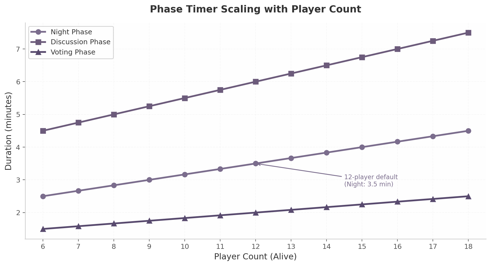
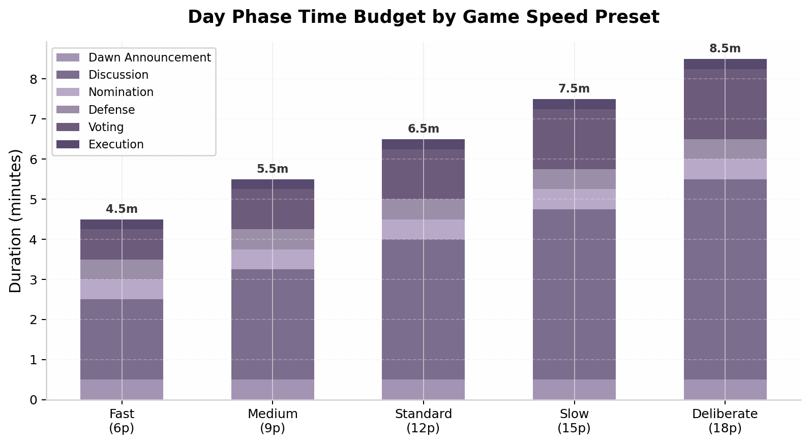
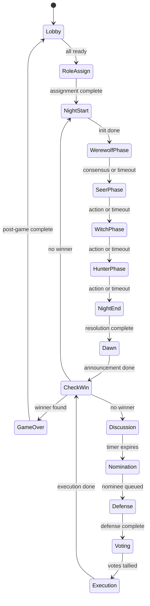

## 3. Game Loop & Phase Management

### 3.1 Game Lifecycle

#### 3.1.1 Lifecycle Overview

The Werewolf game engine progresses through five macro-stages: **Lobby**, **Setup**, **Active** (alternating Night and Day phases), **Resolution**, and **Post-Game**. Each stage operates as a distinct mode with unique validation rules, timer behaviors, and information disclosure boundaries. The complete lifecycle follows a composite Finite State Machine (FSM) pattern where "each state has its own code and behavior, and the machine can only be in one state at a time" [^76^]. Every phase transition emits an immutable event to the event stream, enabling full game replay and analytics reconstruction [^172^].

#### 3.1.2 Lobby Mechanics

The Lobby stage handles room creation and player aggregation. A host creates a room through the Game Server API, which generates a 6-digit alphanumeric join code (e.g., `A7B2C3`) and instantiates a `GameRoom` in Redis. Players join via WebSocket using this code; the server adds their socket to the room namespace and broadcasts a `PLAYER_JOINED` event [^197^].

| Constraint | Value | Rationale |
|------------|-------|-----------|
| Minimum players | 6 | Below this, faction distribution cannot produce meaningful play [^44^] |
| Maximum players | 18 | Upper bound for practical discussion-phase resolution |
| Human player requirement | At least 1 | Zero-human games route to AI Simulation pipeline |
| Lobby timeout | 10 minutes | Auto-backfill vacant slots with AI agents after expiry [^70^] |
| Join code format | 6-digit alphanumeric | 2.17 billion unique codes; collision-resistant |

The host may configure game speed presets, role reveal rules, and start phase. If the lobby fails to reach minimum capacity within 10 minutes, the server backfills vacant slots with AI agents [^70^].

#### 3.1.3 Setup Sequence

The Setup stage executes four steps: (1) **Role Assignment** distributes roles using the Ultimate Werewolf character value system (sum of weights ≈ 0 for balance) [^172^]; (2) **Faction Distribution Validation** confirms the werewolf-to-villager ratio (typically 3:1 to 4:1) [^44^]; (3) **AI Agent Initialization** loads role-specific prompts for backfilled slots; (4) **Werewolf Team Disclosure** sends each wolf player the identities of all faction members.

```typescript
function assignRoles(players: Player[], config: SetupConfig): RoleAssignment {
  const rolePool = buildWeightedPool(config.template);
  const assignments = shuffleAndDeal(players, rolePool);

  const wolves = assignments.filter(p => p.faction === Faction.WEREWOLF);
  const villagers = assignments.filter(p => p.faction === Faction.VILLAGE);
  const ratio = villagers.length / Math.max(wolves.length, 1);

  if (ratio < config.minRatio || ratio > config.maxRatio) {
    throw new ValidationError(
      `Ratio ${ratio.toFixed(1)} outside bounds [${config.minRatio}, ${config.maxRatio}]`
    );
  }

  for (const player of assignments) {
    if (player.isAI) {
      player.agentContext = initializeAgentPrompt({
        role: player.role,
        faction: player.faction,
        teammates: player.faction === Faction.WEREWOLF
          ? assignments.filter(p => p.faction === Faction.WEREWOLF && p.id !== player.id)
          : [],
        winCondition: getWinCondition(player.role),
      });
    }
  }

  return { assignments, wolfCount: wolves.length, villagerCount: villagers.length };
}
```

The assignment algorithm runs server-side only; role information never traverses the network until game end or death reveal. This zero-knowledge approach prevents client-side inspection from uncovering hidden roles [^45^].

### 3.2 Night Phase

#### 3.2.1 Night Structure

The Night phase follows **sequential action collection with simultaneous resolution**: players submit actions in defined order (Werewolves first, then special roles), but all actions resolve together at `NIGHT_END` via the 11-category priority pipeline. No player observes another's action in real time [^46^]. The night phase comprises three sub-states: `NIGHT_START` (instant, initializes meetings), `NIGHT_MAIN` (timer-driven, collects actions), and `NIGHT_RESOLUTION` (instant, executes the pipeline) [^28^].

#### 3.2.2 Werewolf Pack Communication

Werewolves occupy a private WebSocket sub-room (`game:{id}:werewolf`). During `NIGHT_MAIN`, wolves exchange messages and nominate kill targets. The kill target requires a **majority vote** among living wolves; if no consensus is reached before timer expiry, no kill occurs [^56^].

```typescript
class WerewolfPackRoom {
  private wolfVotes: Map<string, string> = new Map();

  async submitKillVote(voterId: string, targetId: string): Promise<void> {
    if (!this.isWolf(voterId) || !this.isAlive(voterId)) {
      throw new ActionError('Invalid voter');
    }
    if (!this.isAlive(targetId) || this.isWolf(targetId)) {
      throw new ActionError('Invalid target');
    }
    this.wolfVotes.set(voterId, targetId);
    this.broadcastToWolves({ type: 'WW_VOTE_RECEIVED', voterId, targetId });

    const voteCounts = this.tallyVotes();
    const majority = this.getMajorityThreshold();
    for (const [target, count] of voteCounts.entries()) {
      if (count >= majority) {
        this.broadcastToWolves({ type: 'WW_CONSENSUS_REACHED', killTarget: target });
        this.game.advancePhase();
        return;
      }
    }
    if (this.wolfVotes.size === this.livingWolves.length) {
      this.broadcastToWolves({ type: 'WW_NO_CONSENSUS' });
      this.game.advancePhase();
    }
  }
}
```

#### 3.2.3 Night Action Resolution Order

Night actions resolve through an 11-category pipeline derived from the werewolv.es production system [^46^]. Actions within the same category execute simultaneously; conflicts resolve through deterministic server-defined ordering.

#### 3.2.4 Resolution Order Table

| Priority | Category | Roles / Actions | Target Selection | Result Visibility |
|----------|----------|-----------------|-------------------|-------------------|
| 1 | Redirects | Succubus | Another player's action target | Only redirector |
| 2 | Roleblocks | Direwolf, Courtesan | Any living player's night action | Only roleblocker |
| 3 | Protection Visits | Bodyguard, Huntsman, Shaman | Any living player (excluding self-consecutive) | Only protector |
| 4 | Most Visits | Seer investigate, Witch poison prep | Varies by role | Only acting player |
| 5 | Item Thefts | Ability/potion theft from target | Any player with items | Only thief |
| 6 | Kills | Werewolf pack kill, Witch poison, Serial Killer | Any living player | Public at dawn |
| 7 | Report Visits | Stalker, Harlot, Familiar | Observed player's visitors | Only observer |
| 8 | Passing of Items | Item transfer between players | Agreed recipient | Both parties |
| 9 | Swap Identities | Djinn, Shapeshifter | Two target players | Only swapper |
| 10 | Report Kills | Village death announcement | All deceased this night | Public broadcast |
| 11 | Report Revives | Village revive announcement | All revived this night | Public broadcast |

The resolution engine implements six conflict rules [^46^]: (1) redirects and swaps execute in deterministic order; (2) multiple roleblocks on one target produce no cumulative effect; (3) each protection blocks one kill independently with all triggered effects firing; (4) simultaneous item theft from one target yields nothing; (5) simultaneous kills attribute death to the first killer in server order but all effects trigger; (6) roleblockers may themselves be roleblocked.

```python
def resolve_night_actions(actions: list[NightAction], state: GameState) -> NightResult:
    result = NightResult()
    blocked_players = set()
    active_protections = defaultdict(list)
    kill_results = []

    for action in filter_by_category(actions, ActionCategory.REDIRECT):
        apply_redirect(action, state)
    for action in filter_by_category(actions, ActionCategory.ROLEBLOCK):
        if action.source.id not in blocked_players:
            blocked_players.add(action.target.id)
    for action in filter_by_category(actions, ActionCategory.PROTECTION):
        if action.source.id not in blocked_players:
            active_protections[action.target.id].append(action)
    for action in filter_by_category(actions, ActionCategory.KILL):
        if action.source.id not in blocked_players:
            kill_result = resolve_kill(action, active_protections, state)
            kill_results.append(kill_result)
    for action in filter_by_category(actions, ActionCategory.IDENTITY_SWAP):
        swap_identities(action, state)

    result.deaths = [kr for kr in kill_results if kr.target_died]
    return result
```

#### 3.2.5 Night Timer

The default night timer starts at **90 seconds** and extends by **10 seconds per living player**. If all required actions are submitted before expiry, the phase ends after a 5-second grace period. On timeout, the server assigns default actions and forces transition to `NIGHT_RESOLUTION` [^70^]. The timer runs at 1-4 ticks per second, consistent with Nakama's recommendation for turn-based multiplayer games [^183^].



*Figure 3.1 — Phase duration scales linearly with player count. At 12 players, Night takes 3.5 min, Discussion 6.0 min, Voting 2.0 min.*

### 3.3 Day Phase

#### 3.3.1 Day Structure

The Day phase comprises six sub-phases: **Dawn Announcement** (death reveals), **Discussion** (open deliberation), **Nomination** (accusation), **Defense Speech** (rebuttal), **Voting** (plurality ballot), and **Execution** (elimination). CheckWin evaluates conditions after both Dawn and Execution [^171^].

#### 3.3.2 Discussion Mechanics

The Discussion sub-phase opens a public chat channel for all living players. Duration is 3 minutes, scaling at 15 seconds per living player. A configurable speaking queue lets players request the floor for up to 60 seconds per turn, preventing dominant voices from monopolizing deliberation [^106^].

#### 3.3.3 Nomination

Any living player may nominate another for execution. Once a nomination receives a **second**, the nominee enters Defense and receives **30 seconds** for a defense statement. Multiple nominations may occur sequentially; each nominee gets a defense slot before voting begins [^212^].

#### 3.3.4 Voting

Voting uses **plurality**: the nominee with the most votes is executed. The ballot may be public (votes visible in real time) or secret (votes revealed at tally). Ties resolve to **no execution** unless the host enables tiebreaker variants [^212^]. The Vote Lock period freezes all votes 30 seconds before expiry [^70^].

#### 3.3.5 Complete Phase Specification Matrix

| Phase | Sub-Phase | Base Duration | Per-Player Additive | Player Actions | System Actions |
|-------|-----------|---------------|--------------------|----------------|----------------|
| Night | Night Start | 5s | 0s | None | Initialize meetings, process delayed deaths |
| Night | Werewolf Discussion | 60s | 10s | Chat, nominate kill target | Tally wolf votes, check consensus |
| Night | Seer Check | 30s | 5s | Select investigation target | Record alignment result |
| Night | Bodyguard Protect | 30s | 5s | Select protection target | Register protection visit |
| Night | Witch Action | 30s | 5s | Choose heal/poison targets | Consume potions, register effects |
| Night | Night Resolution | 5s | 0s | None | Execute 11-category pipeline |
| Day | Dawn Announcement | 15s | 0s | None | Reveal deaths, reveal roles (if enabled) |
| Day | Discussion | 180s | 15s | Open chat, optional speaking queue | Enforce timer, log messages |
| Day | Nomination | 30s | 5s | Nominate, second nominations | Track nomination queue |
| Day | Defense Speech | 30s | 0s | Deliver defense statement | Enforce no-interrupt rule |
| Day | Voting | 60s | 5s | Cast vote (public or secret) | Tally votes, check majority |
| Day | Execution | 10s | 0s | None | Eliminate target, trigger death effects |



*Figure 3.2 — Day phase time budget across six sub-phases. Discussion dominates at 47-59% of total day time.*

```typescript
class DayPhaseOrchestrator {
  private currentSubPhase: DaySubPhase = DaySubPhase.DAWN;

  async advanceSubPhase(): Promise<void> {
    switch (this.currentSubPhase) {
      case DaySubPhase.DAWN:
        await this.announceDeaths();
        this.currentSubPhase = DaySubPhase.DISCUSSION;
        this.startTimer(this.getDiscussionDuration());
        break;
      case DaySubPhase.DISCUSSION:
        this.currentSubPhase = DaySubPhase.NOMINATION;
        this.openNominations();
        break;
      case DaySubPhase.NOMINATION:
        if (this.nominationQueue.length > 0) {
          this.currentSubPhase = DaySubPhase.DEFENSE;
          await this.startDefenseSpeech(this.nominationQueue[0]);
        } else {
          this.currentSubPhase = DaySubPhase.VOTING;
          this.startVoting();
        }
        break;
      case DaySubPhase.DEFENSE:
        this.nominationQueue.shift();
        if (this.nominationQueue.length > 0) {
          await this.startDefenseSpeech(this.nominationQueue[0]);
        } else {
          this.currentSubPhase = DaySubPhase.VOTING;
          this.startVoting();
        }
        break;
      case DaySubPhase.VOTING:
        this.currentSubPhase = DaySubPhase.EXECUTION;
        await this.executeHighestVote();
        break;
    }
  }

  private getDiscussionDuration(): number {
    return (180 + this.game.alivePlayers.length * 15) * 1000;
  }
}
```

### 3.4 Phase State Machine

#### 3.4.1 15-State FSM

The game engine implements a 15-state Finite State Machine with composite states for Night and Day. Each state defines three handlers: `onEnter` (setup), `handleAction` (player input), and `onTimerExpired` (forced transition). The FSM provides "clear transitions" between discrete game stages [^76^].



*Figure 3.3 — 15-state game FSM. Night sub-states collect actions sequentially; NightEnd applies the 11-category pipeline. All paths converge through CheckWin.*

#### 3.4.2 State Machine Implementation

The FSM couples transition guards with validation logic. Each transition carries a predicate that inspects game context before permitting the state change [^170^] [^223^].

```typescript
const TRANSITION_MATRIX: Map<GamePhase, Map<GamePhase, TransitionGuard>> = new Map([
  [GamePhase.LOBBY, new Map([
    [GamePhase.ROLE_ASSIGN, (ctx) =>
      ctx.playerCount >= ctx.config.minPlayers && ctx.allPlayersReady
        ? ValidationResult.VALID : ValidationResult.INSUFFICIENT_PLAYERS]
  ])],
  [GamePhase.WEREWOLF_PHASE, new Map([
    [GamePhase.SEER_PHASE, (ctx) =>
      ctx.werewolfConsensus !== null || ctx.phaseTimer <= 0
        ? ValidationResult.VALID : ValidationResult.MISSING_ACTIONS]
  ])],
  [GamePhase.EXECUTION, new Map([
    [GamePhase.CHECK_WIN, () => ValidationResult.VALID]
  ])],
  [GamePhase.CHECK_WIN, new Map([
    [GamePhase.GAME_OVER, (ctx) =>
      ctx.winner !== null ? ValidationResult.VALID : ValidationResult.NO_WINNER],
    [GamePhase.NIGHT_START, (ctx) =>
      ctx.winner === null ? ValidationResult.VALID : ValidationResult.WINNER_EXISTS]
  ])],
]);

function validateTransition(
  from: GamePhase, to: GamePhase, ctx: GameContext
): ValidationResult {
  const fromMap = TRANSITION_MATRIX.get(from);
  if (!fromMap || !fromMap.has(to)) return ValidationResult.INVALID_TRANSITION;
  return fromMap.get(to)!(ctx);
}
```

#### 3.4.3 Transition Triggers

State transitions fire on one of four trigger types.

| Trigger Type | Description | Example |
|-------------|-------------|---------|
| Timer expiry | Phase duration elapsed; default actions assigned | Night timer reaches zero, unresolved actions default to NO_ACTION |
| Unanimous action | All required players submitted valid actions | All werewolves voted for same kill target |
| Host override | Room owner forces phase advance | Host skips remaining discussion time |
| System event | Automated trigger from game rules | Meteor deadlock resolution fires after 5-6 indecision rounds [^70^] |

The `onTimerExpired` handler assigns default actions to non-acted players, then advances the phase. Villagers default to `NO_ACTION`, Werewolves to `NO_KILL`, the Seer to a random living target, and the Bodyguard to self-protection.

#### 3.4.4 Timer Configuration Table

| Phase | Base Duration | Per-Player Additive | Fast Preset | Medium Preset | Standard Preset | Slow Preset |
|-------|--------------|--------------------|-------------|---------------|-----------------|-------------|
| Night (total) | 90s | +10s | 2.0 min | 2.8 min | 3.5 min | 4.5 min |
| Werewolf Discussion | 60s | +10s | 1.5 min | 2.0 min | 2.5 min | 3.0 min |
| Discussion (Day) | 180s | +15s | 3.0 min | 4.5 min | 6.0 min | 7.5 min |
| Nomination | 30s | +5s | 0.8 min | 1.0 min | 1.3 min | 1.5 min |
| Defense Speech | 30s | 0s | 0.5 min | 0.5 min | 0.5 min | 0.5 min |
| Voting | 60s | +5s | 1.3 min | 1.5 min | 1.8 min | 2.0 min |
| Vote Lock | 30s | 0s | 0.5 min | 0.5 min | 0.5 min | 0.5 min |

The **Scale Timer** feature dynamically adjusts durations based on the ratio of living players to starting players. The timer runs at 70% of configured duration at 100% alive, scales to 100% at 50% alive, and returns to 70% at near-zero alive [^70^].

```mermaid
graph TD
    A[Start Timer] --> B{Scale Timer Enabled?}
    B -->|No| C[Return Raw Duration]
    B -->|Yes| D[Calculate Alive Ratio]
    D --> E{Ratio >= 0.5?}
    E -->|Yes| F[Factor = 0.70 + 0.30 * ((1.0 - Ratio) / 0.5)]
    E -->|No| G[Factor = 1.00 - 0.30 * ((0.5 - Ratio) / 0.5)]
    F --> H[Return Duration * Factor]
    G --> H
```

*Figure 3.4 — Scale timer computation. The symmetric bell curve peaks at 50% alive, giving mid-game phases maximum deliberation time.*

```typescript
class PhaseTimer {
  getDuration(phase: GamePhase): number {
    const base = this.config.baseDurations[phase];
    const additive = this.config.perPlayerAdditive[phase] * this.alivePlayers;
    const rawDuration = base + additive;
    if (!this.config.scaleTimerEnabled) return rawDuration;

    const aliveRatio = this.alivePlayers / this.startingPlayers;
    const scaleFactor = aliveRatio >= 0.5
      ? 0.70 + 0.30 * ((1.0 - aliveRatio) / 0.5)
      : 1.00 - 0.30 * ((0.5 - aliveRatio) / 0.5);
    return Math.round(rawDuration * scaleFactor);
  }

  onTick(): void {
    this.remainingSeconds--;
    this.broadcastTimerUpdate(this.remainingSeconds);
    if (this.remainingSeconds <= 0) this.forceAdvancePhase();
  }
}
```

### 3.5 Win Condition Detection

#### 3.5.1 Win Conditions

The engine evaluates three victory categories after each elimination. The parity rule — wolves win when `wolfCount >= nonWolfCount` — is standard across all major rule sets [^56^] [^73^]. Town of Salem allows "multiple winners, one winner, or no winners" depending on configuration [^103^].

| Faction | Win Condition | Evaluation Trigger |
|---------|--------------|-------------------|
| Village | All werewolf-aligned players dead | After each dawn, after each execution |
| Werewolf | Wolf count >= non-wolf count (parity) | After each dawn, after each execution |
| Fool / Jester | Voted out during day (independent) | During execution phase only |
| Serial Killer | Last player alive | After each dawn, after each execution |
| Cult Leader | All living players are cult members | After each dawn, after each execution |

A simultaneous elimination scenario — where the last wolf and last non-wolf die in the same event — produces a **draw** rather than a faction victory [^256^]. The engine checks simultaneous elimination before faction wins.

#### 3.5.2 Win Detection Algorithm

The win detector runs after four trigger points: dawn, execution, Hunter revenge, and meteor resolution [^171^]. Evaluation follows precedence order: simultaneous draw first, then village win, then wolf parity, then neutral conditions.

```typescript
function evaluateWinConditions(state: GameState): WinResult {
  const alive = state.players.filter(p => p.isAlive);
  const wolves = alive.filter(p => p.faction === Faction.WEREWOLF);
  const nonWolves = alive.filter(p => p.faction !== Faction.WEREWOLF);

  if (state.simultaneousDeaths.length >= 2) {
    const factions = new Set(state.simultaneousDeaths.map(d => d.faction));
    if (factions.has(Faction.WEREWOLF) && factions.has(Faction.VILLAGE)) {
      return { type: WinType.DRAW, reason: 'simultaneous_elimination' };
    }
  }
  if (wolves.length === 0) {
    return { type: WinType.VILLAGE_WIN, reason: 'all_wolves_dead' };
  }
  if (wolves.length >= nonWolves.length) {
    return { type: WinType.WEREWOLF_WIN, reason: 'parity_reached' };
  }
  for (const neutral of alive.filter(p => p.faction === Faction.NEUTRAL)) {
    if (neutral.role === Role.FOOL && neutral.wasVotedOut) {
      return { type: WinType.FOOL_WIN, player: neutral.id };
    }
    if (neutral.role === Role.SERIAL_KILLER && alive.length === 1) {
      return { type: WinType.SERIAL_KILLER_WIN, player: neutral.id };
    }
  }
  return { type: WinType.NO_WINNER };
}
```

#### 3.5.3 Game End Sequence

Upon detecting a winner, the engine executes a five-step termination: (1) reveal all hidden roles to all players; (2) compute final scores using per-role ELO tracking; (3) persist the event stream to PostgreSQL for analytics; (4) broadcast a `GAME_ENDED` event with winning faction and performance metrics; (5) after a 30-second post-game viewing period, transition back to Lobby.

The deadlock prevention system (meteor mechanic) fires if 5-6 consecutive full cycles pass with no lynch and no wolf kill, eliminating all members of the offending faction [^70^] [^181^]. This prevents indefinite stalling where wolves refuse to kill to preserve parity and the village refuses to lynch from mislynch fear.

The event sourcing architecture records every phase transition and win check as an immutable event. "Redis Streams capture every player action as immutable events" [^172^]. Each win evaluation generates a `WIN_CONDITION_CHECKED` event with faction counts and the resulting decision, creating a transparent audit trail [^170^].
ams capture every player action as immutable events" [^172^]. Each win evaluation generates a `WIN_CONDITION_CHECKED` event with faction counts and the resulting decision, creating a transparent audit trail [^170^].
