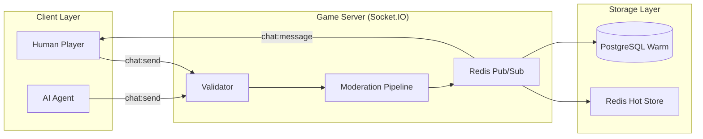
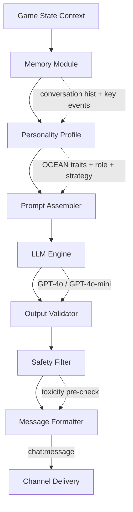
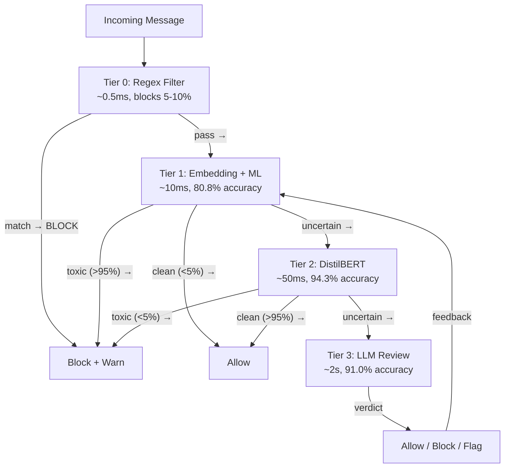

## 5. Chat & Communication System

### 5.1 Communication Architecture

The chat system routes all player and AI dialogue through six channels, each gated by the 15-state FSM (Chapter 3) and filtered by role-based information boundaries (Chapter 4). Three requirements are non-negotiable: (1) living players never detect channels they cannot access; (2) every message is recoverable after reconnection; (3) AI-generated speech is protocol-indistinguishable from human messages [^364^] [^428^].

The system uses WebSocket (Socket.IO) with Redis Pub/Sub as the cross-server bus. Each server maintains room memberships per match; messages are published to Redis channels scoped by match and channel ID, then broadcast to subscribers. This yields sub-50 ms end-to-end latency [^364^]. History is stored in Redis Lists (last 200 messages, 24-hour TTL) with asynchronous PostgreSQL persistence for replay and analytics.



**Delivery guarantees.** Messages carry per-channel sequence numbers (64-bit monotonic) ensuring causal ordering. On reconnection, clients request replay from a known offset; the server returns all messages from that offset to the current head. Duplicate suppression uses message ID deduplication client-side. Persistence is three-tiered: Redis (hot, active matches), PostgreSQL (warm, completed games), and S3 (cold, analytics and AI training data).

| Channel | ID Pattern | Gated By | Persistence |
|---------|-----------|----------|-------------|
| Global (Day Chat) | `match:{id}:public` | Alive + Day phase | 24 h Redis → PostgreSQL |
| Werewolf (Night) | `match:{id}:werewolf` | Werewolf role + Night phase | 24 h Redis → PostgreSQL |
| Dead / Spectator | `match:{id}:spectator` | Dead or spectator status | 24 h Redis → PostgreSQL |
| System | `match:{id}:system` | Server-generated only | 48 h Redis → PostgreSQL |
| Whisper | `match:{id}:whisper:{pid}` | Sender + recipient | Ephemeral (5 min TTL) |
| Moderator | `match:{id}:mod` | Server / AI narration | 72 h Redis → PostgreSQL |

Channel isolation is the critical security invariant: "even if a client attempts to subscribe to a restricted channel, the server validates their role before allowing message reception" [^428^]. Non-werewolves receive no evidence the werewolf channel exists.

```typescript
// Message history replay for reconnected clients
async function replayHistory(socket, matchId, channel, lastSeq) {
  const redisKey = `chat:history:${matchId}:${channel}`;
  const messages = await redis.xRange(redisKey, lastSeq, '+');
  for (const msg of messages) {
    socket.emit('chat:message', deserialize(msg));
  }
}
```

The replay function ensures at-least-once delivery across reconnections via Redis Streams with per-channel sequence numbers.

### 5.2 Channel Specifications

**Global day chat.** Active during `DAY_DISCUSS` and `VOTING` phases. Living players send free-form text up to 500 characters with @-mention support. Dead players are automatically removed from this channel's room upon elimination.

**Werewolf night channel.** Visible only to living `WEREWOLF` players during `WW_DISCUSS` and `WW_SELECT`. Werewolves coordinate kill targets and debate strategy; the channel closes on transition to `SEER_ACTION`. Non-werewolves never see this channel in their list [^428^].

**System channel.** Server-generated, read-only announcements: `PhaseChange`, `DeathAnnouncement`, `VoteTally`, `RoleReveal`, and `GameResult`. System messages bypass moderation and persist for 48 hours.

**Dead player chat.** Eliminated players transition to the spectator channel immediately upon death. They chat freely with other dead players and external spectators but are prohibited from communicating with living players — enforced by server-side isolation, not client trust [^357^]. Dead players gain full role visibility but cannot influence the living game.

```typescript
// Channel permission validation (server-side, on every message)
function canSend(channel: Channel, player: Player, phase: GamePhase): boolean {
  switch (channel) {
    case 'public':
      return player.isAlive && (phase === 'DAY_DISCUSS' || phase === 'VOTING');
    case 'werewolf':
      return player.isAlive && player.role === 'WEREWOLF' &&
             (phase === 'WW_DISCUSS' || phase === 'WW_SELECT');
    case 'spectator':
      return !player.isAlive || player.isSpectator;
    case 'whisper':
      return player.isAlive && phase === 'DAY_DISCUSS';
    case 'system':
      return false; // Server-only
    default:
      return false;
  }
}
```

The code above gates every outgoing message by lifecycle state and game phase. The default-deny pattern rejects unknown channels automatically.

**Channel permissions matrix.** The table below consolidates eligibility rules.

| Channel | Eligible Senders | Eligible Receivers | Phase Restriction | Message Types Allowed |
|---------|-----------------|-------------------|-------------------|----------------------|
| Global | Living players | Living players | Day / Voting | FreeText, Vote, Accuse, Defend, ClaimRole |
| Werewolf | Werewolf + alive | Werewolf + alive | WW_DISCUSS, WW_SELECT | FreeText, ActionSubmission |
| System | Server only | All connected | Any | PhaseChange, DeathAnnouncement, VoteTally, RoleReveal, GameResult |
| Dead | Dead + spectators | Dead + spectators | Any (post-elimination) | FreeText |
| Whisper | Living players | Sender + recipient | Day only | FreeText (max 200 chars) |
| Moderator | AI narrator | All connected | Day | Structured narration |

Authorization is enforced server-side on every message; clients receive only channels for which `canSend` evaluates to true. This prevents information leakage through client-side manipulation [^428^].

### 5.3 Message Taxonomy

Every message uses a unified envelope with a `messageType` discriminator, separating player dialogue, system announcements, and AI-internal reasoning into distinct visibility and persistence categories.

**Player messages** include five sub-types. `FreeText` carries dialogue with optional @-mentions and reply threading. `VoteDeclaration` records a nomination with target ID, vote type (lynch / no-lynch), and optional reason. `Accusation` is a structured allegation with target, accusation text, evidence references, and confidence score. `Defense` responds to a specific accusation by message ID with counter-arguments. `ClaimRole` is a public role assertion (e.g., "I am the Seer") with claimed proof.

**System messages** are server-generated and read-only: `PhaseChange` (phase transitions), `DeathAnnouncement` (elimination details), `VoteTally` (aggregated counts), `RoleReveal` (true role on death), and `GameResult` (winning faction).

**AI messages** have two visibility layers. `StructuredReasoning` contains internal strategic analysis logged for training but never sent to clients. `GeneratedSpeech` is the external-facing chat message — structurally identical to human FreeText at the protocol level, with `isAIGenerated` for logging only. `ActionSubmission` encodes night-phase actions in validated JSON.

| Message Type | Sender | Channel | Schema Key Fields | Visibility | Persistence |
|-------------|--------|---------|-------------------|------------|-------------|
| FreeText | Player / AI | Global, WW, Dead | `text`, `mentions`, `replyTo` | Public to channel | Permanent |
| VoteDeclaration | Player / AI | Global | `targetId`, `voteType`, `reason` | Public (tally anon.) | Permanent |
| Accusation | Player / AI | Global | `targetId`, `accusation`, `evidence[]`, `confidence` | Public | Permanent |
| Defense | Player / AI | Global | `responseTo`, `defense`, `counterArguments[]` | Public | Permanent |
| ClaimRole | Player / AI | Global | `claimedRole`, `proof{}`, `isCounterClaim` | Public | Permanent |
| PhaseChange | System | All | `newPhase`, `duration`, `affectedPlayers[]` | Broadcast | Permanent |
| DeathAnnouncement | System | All | `playerId`, `cause`, `roleReveal?` | Broadcast | Permanent |
| VoteTally | System | All | `tally{}`, `eliminatedId?` | Broadcast | Permanent |
| RoleReveal | System | All | `playerId`, `actualRole` | On death / end | Permanent |
| StructuredReasoning | AI | Internal only | `suspicionScores{}`, `plannedStrategy` | Server only | Training log |
| GeneratedSpeech | AI | Global, WW | `text`, `targetPlayer?`, `messageType` | Channel public | Permanent |
| ActionSubmission | AI | Internal → Engine | `action`, `target`, `reasoning` | Server only | Event log |

This taxonomy reveals a deliberate design choice: AI agents produce an internal reasoning document and an external speech message per turn, with only the latter visible to players. This enables post-hoc analysis while preserving the social illusion.

```json
{
  "id": "msg_uuid_v4",
  "timestamp": "2026-01-15T10:30:00.000Z",
  "matchId": "match_uuid",
  "channel": "public",
  "senderId": "player_uuid",
  "senderName": "PlayerName",
  "messageType": "Accuse",
  "content": {
    "targetId": "player3_uuid",
    "accusation": "I believe Player3 is a werewolf...",
    "evidence": ["day1_statement", "day2_vote_pattern"],
    "confidence": 0.75
  },
  "metadata": { "gamePhase": "day", "roundNumber": 3, "moderationScore": 0.02 }
}
```

Every message carries a `metadata` block recording game phase, round number, and moderation outcome, enabling replay reconstruction and analytics.

### 5.4 AI Speech Generation

AI agents generate dialogue through a six-stage NLP pipeline: game context ingestion → personality filtering → prompt construction → LLM generation → safety filtering → chat delivery. Research demonstrates that "personality-conditioned LLM agents adapt their expressive behaviors across conversational contexts" [^249^]; the system uses the Big Five (OCEAN) model for consistent character voices.



The Memory Module feeds conversation history and key game events into the prompt. The Personality Profile applies OCEAN trait vectors (Openness, Conscientiousness, Extraversion, Agreeableness, Neuroticism) on a 0.0–1.0 scale, mapping directly to dialogue characteristics: high-Extraversion agents initiate frequently; high-Neuroticism produces anxious language; low-Agreeableness yields aggressive accusation patterns [^249^].

The system implements three generation tiers. Tier 1 (Canned Phrases) serves acknowledgments from a pre-authored bank at sub-1 ms latency. Tier 2 (Template + Personality) fills role-specific templates with personality-weighted vocabulary at 5–15 ms. Tier 3 (Fully Generated) submits constructed prompts to an LLM (GPT-4o for complex deception, GPT-4o-mini for routine speech) at 500–2,000 ms. A neuro-symbolic router selects the tier per context; the hybrid architecture achieves +7.2% entailment consistency over pure LLM approaches [^205^].

```python
# Tier selection and prompt assembly
class SpeechGenerator:
    TIER_THRESHOLD_SIMPLE = 0.3   # Low complexity → Tier 1/2
    TIER_THRESHOLD_COMPLEX = 0.7  # High complexity → Tier 3

    def select_tier(self, context: GameContext) -> int:
        complexity = self._assess_complexity(context)
        if complexity < self.TIER_THRESHOLD_SIMPLE:
            return 1 if context.is_acknowledgment else 2
        return 3

    def generate(self, context: GameContext, personality: OCEAN) -> str:
        tier = self.select_tier(context)
        if tier == 1:
            return self._canned_phrase(context, personality)
        elif tier == 2:
            return self._template_fill(context, personality)
        # Tier 3: full LLM generation
        prompt = self._assemble_prompt(context, personality)
        response = await self.llm.complete(
            prompt,
            model="gpt-4o" if complexity > 0.8 else "gpt-4o-mini",
            response_format={"type": "json_object"}
        )
        return self._validate_and_extract(response)
```

The `_assess_complexity` function scores context on player count, contradictions, pending accusations, and phase urgency. Model routing sends simple responses through GPT-4o-mini ($0.15/M tokens) and complex deception through GPT-4o ($2.50/M tokens), yielding 40–70% cost savings [^25^].

Contextual awareness requires the AI to reference specific game events. The prompt assembler injects five signals: (a) recent vote tallies; (b) outstanding accusations; (c) death announcements; (d) the agent's suspicion scores and trust network; (e) current phase conversation history. Research confirms that "even when given identical personality prompts, LLM agents' linguistic and behavioral patterns varied systematically depending on the social goals of each task" [^346^].

| Trait | Range | Dialogue Effect | High Value Behavior | Low Value Behavior |
|-------|-------|-----------------|---------------------|---------------------|
| Openness | 0.0–1.0 | Creativity and strategic novelty | Unconventional accusations, novel arguments | Traditional, predictable approaches |
| Conscientiousness | 0.0–1.0 | Reasoning thoroughness | Detailed evidence-based claims | Impulsive, gut-feel statements |
| Extraversion | 0.0–1.0 | Communication frequency | Initiates discussions, frequent messages | Quiet, responds only when addressed |
| Agreeableness | 0.0–1.0 | Social cooperativeness | Defends allies, cooperative tone | Aggressive, accuses freely |
| Neuroticism | 0.0–1.0 | Emotional stability | Anxious language, self-doubt under pressure | Confident, decisive statements |

The OCEAN configuration provides the personality foundation for Tier 2 and Tier 3 generation, enabling reproducible character voices [^249^].

| Tier | Method | Latency | Cost/msg | Best For |
|------|--------|---------|----------|----------|
| 1 — Canned | Phrase bank | <1 ms | Negligible | Acknowledgments, greetings, fillers |
| 2 — Template | Slot-filling + personality | 5–15 ms | Negligible | Routine statements, simple votes |
| 3 — Full LLM | GPT-4o / GPT-4o-mini | 500–2,000 ms | $0.003–0.015 | Complex deception, defense, accusations |

**Rate limiting for AI agents.** Each AI agent may submit a maximum of 3 messages per discussion phase with a minimum 5-second inter-message cooldown. This prevents AI agents from dominating the conversation and mirrors human typing constraints. The sliding-window rate limiter uses Redis sorted sets for per-player tracking.

```javascript
// Redis-backed sliding window rate limiter (per player, per phase)
async function checkRateLimit(playerId, channel, maxRequests, windowMs) {
  const key = `ratelimit:${playerId}:${channel}`;
  const now = Date.now();
  const windowStart = now - windowMs;
  const pipeline = redis.pipeline();
  pipeline.zremrangebyscore(key, 0, windowStart);
  pipeline.zcard(key);
  pipeline.zadd(key, now, `${now}-${Math.random()}`);
  pipeline.pexpire(key, windowMs);
  const [, count] = await pipeline.exec();
  return { allowed: count < maxRequests, remaining: maxRequests - count - 1 };
}
```

The rate limiter enforces per-channel, per-player caps at O(1) complexity. Additional anti-spam rules: no identical repeats within 60 s; max 80% caps ratio; and character-flood detection for 10+ identical characters [^405^].

### 5.5 Moderation & Safety

All messages pass through a 4-tier moderation pipeline before delivery. The design follows a cascaded confidence-guided approach where each tier handles cases the previous tier could not resolve [^345^]. This balances real-time performance (<100 ms in the common case) against detection accuracy (>90% recall).



**Tier 0 — Regex filter.** A compiled blacklist executes in <1 ms, blocking 5–10% of blatant violations with no false positives on gaming phrases.

**Tier 1 — Embedding + ML classifier.** Sentence-BERT embeddings feed into an SVM ensemble on CPU at 28.24 messages/second with ~35 ms latency [^345^]. Accuracy: 80.8% overall, 61.2% recall. Messages below 5% toxicity pass; above 95% are blocked; the uncertain band proceeds to Tier 2.

**Tier 2 — Fine-tuned transformer.** DistilBERT on GPU achieves 94.3% accuracy and 91.8% recall at ~50–100 ms [^345^]. Research notes that "fine-tuned DistilBERT achieves superior accuracy compared to all other methods while maintaining excellent precision and recall balance" [^345^].

**Tier 3 — LLM review.** GPT-4o with few-shot prompting handles edge cases asynchronously at 1–2 seconds, with 91.0% accuracy and 90.6% recall [^345^]. At ~$2,600× the cost of embedding methods per message, this tier is reserved for appeals and ambiguous cases only.


Tier 2 (DistilBERT) occupies the performance sweet spot at 94.3% accuracy and ~50 ms latency, suitable for inline screening. Tier 3 (LLM Review) is relegated to asynchronous review due to its 2-second latency.

**Moderation actions.** The pipeline applies one of five actions per message: `allow` (pass through), `mask` (replace profanity with asterisks), `block` (reject delivery), `flag` (deliver but queue for human review), and `mute` (block + impose temporary channel or match-wide mute). Action selection follows severity escalation.

| Severity | Trigger | Auto-Action | Escalation |
|----------|---------|-------------|------------|
| Low (spam) | Repeated messages, noise | Rate limit + Warn | None |
| Medium (profanity) | Context-dependent offensive language | Mask or Warn | Mute 5 min |
| High (harassment) | Targeted abuse at specific players | Block + Mute 2 h | Human review |
| Critical (hate speech) | Attacks on protected characteristics | Block + Mute 24 h | Human review + Alert |
| Critical (self-harm) | References to self-injury | Block + Alert moderator | Immediate human review |

Werewolf-specific rules modify severity: accusations such as "you're the wolf" or "you're lying" are gameplay elements receiving automatic `allow` classification via soft-prompting with game-context tokens [^400^]. Ubisoft's ToxBuster system validates this approach for per-genre moderation adaptation.

```python
# Moderation pipeline with Werewolf context awareness
class ModerationPipeline:
    GAME_CONTEXT_TOKEN = "GAME_WEREWOLF"

    async def moderate(self, message: str, context: GameContext) -> ModerationResult:
        # Tier 0: Regex (instant)
        if block := self.tier0_regex.check(message):
            return ModerationResult(action="block", tier=0, reason=block)

        # Tier 1: Embedding + ML
        score = await self.tier1_embedding.score(message, self.GAME_CONTEXT_TOKEN)
        if score < 0.05:
            return ModerationResult(action="allow", tier=1, score=score)
        if score > 0.95:
            return ModerationResult(action="block", tier=1, score=score)

        # Tier 2: DistilBERT (GPU)
        score = await self.tier2_transformer.score(message, self.GAME_CONTEXT_TOKEN)
        if score > 0.95:
            return ModerationResult(action="block", tier=2, score=score)
        if score < 0.05:
            return ModerationResult(action="allow", tier=2, score=score)

        # Tier 3: LLM async review (uncertain cases)
        asyncio.create_task(self.tier3_llm_review(message, context))
        return ModerationResult(action="flag", tier=2, score=score)
```

The pipeline encodes the Werewolf context token at every tier, ensuring accusations and strategic deception are not misclassified as toxic [^345^]. A feedback loop from Tier 3 outcomes periodically retrains Tiers 1 and 2.

**AI safety guardrails.** AI speech passes four policy checks: (1) prompt-level refusal training blocks off-topic content and harmful instructions; (2) output guardrails enforce a 300-character limit and prohibit profanity regardless of persona; (3) platform terms are enforced even when in-character dialogue would violate them; (4) all outputs are logged with prompt context for safety auditing. The `isAIGenerated` flag is never exposed to clients — AI messages are structurally identical to human messages, preserving game integrity.
