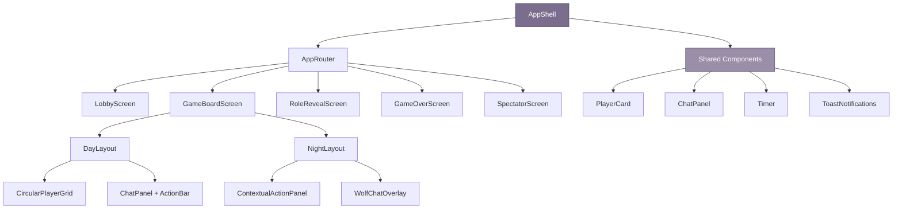
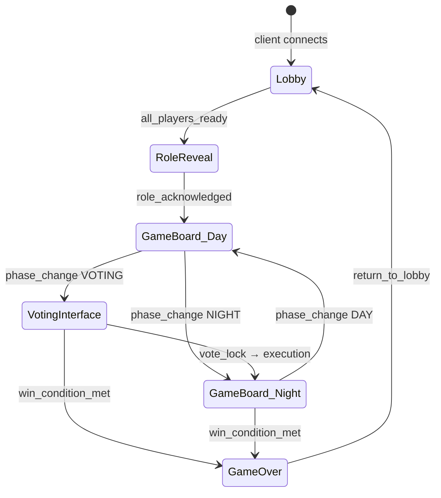
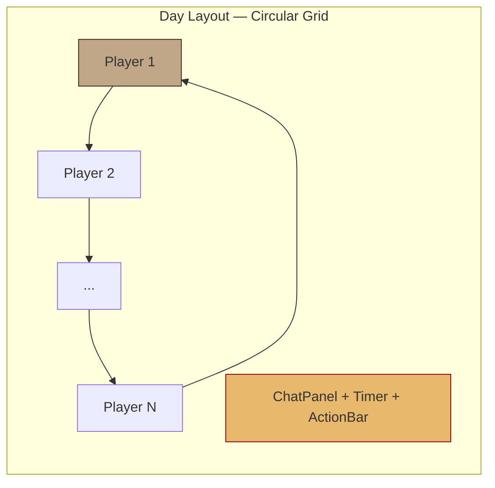
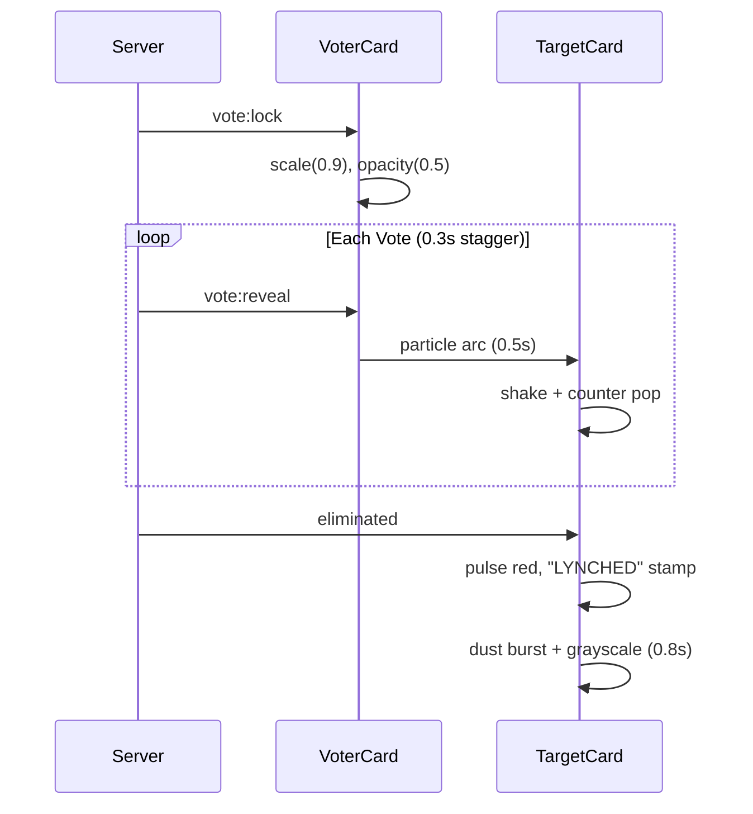
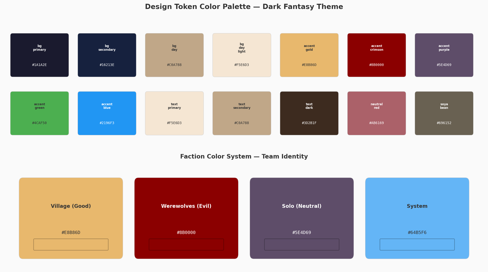

# 6. UI/UX, Animations & Visual Effects

## 6.1 UI Architecture

### 6.1.1 Screen Inventory

The client implements eight screens mapped to the 15-state FSM from Chapter 3. `phase_change` events determine which screen renders; the UI layer never independently selects screens [^170^].

| Screen | Purpose | Entry Condition | Exit Condition | Key Components |
|--------|---------|-----------------|----------------|----------------|
| Lobby | Room creation, join, ready-up | Client connects | Host starts game | PlayerList, ChatPanel, RoleSetup, ReadyButton |
| GameBoard (Day) | Public discussion + voting | `DAY_DISCUSSION` or `DAY_VOTING` | Phase to `NIGHT_START` | PlayerCardGrid, ChatPanel, Timer, ActionBar |
| GameBoard (Night) | Secret role actions | `NIGHT_PHASE` active | `NIGHT_END` complete | PlayerCardGrid (dimmed), ContextualActionPanel, WolfChatOverlay |
| RoleReveal | Private role assignment display | `ROLE_ASSIGNMENT` complete | Player dismisses (auto 5s) | RoleCard (flippable), AbilityDescription, FactionBanner |
| VotingInterface | Plurality voting + tally | `DAY_VOTING` phase | `VOTE_LOCK` begins | VoteButtons, TallyBar, CountdownTimer |
| GameOver | Final results, role exposure | `GAME_OVER` phase | Return to Lobby | WinnerBanner, RoleRevealGrid, StatisticsPanel |
| Settings | Audio, display, accessibility | Player opens menu | Player closes menu | VolumeSliders, ThemeToggle, AccessibilityOptions |
| SpectatorView | Full-information observation | Client joins as spectator | Spectator disconnects | FullRoleGrid, AnalyticsPanel, DelayedStreamIndicator |

The RoleReveal screen appears twice: privately at match start and publicly at game end. SpectatorView bypasses information hiding, displaying all roles simultaneously [^484^]. Active players follow: **Lobby → RoleReveal → GameBoard (Day/Night cycles) → GameOver → Lobby**.

### 6.1.2 Component Hierarchy

`AppRouter` subscribes to `system:phase_change` and selects the active screen. Shared components reside in a persistent shell:



Components receive `gamePhase`, `playerId`, and `isAlive` from a Zustand store synchronized via `game:state_update`. Subscribed slices trigger re-renders, avoiding prop drilling [^14^].

### 6.1.3 Real-Time Synchronization

The client implements optimistic updates for voting: local tally updates before server confirmation. Rejection (target dead, phase ended) triggers rollback with a toast.

```typescript
const useVoteState = () => {
  const [votes, setVotes] = useState<VoteMap>({});
  useEffect(() => {
    socket.on('vote:confirmed', ({ voterId, targetId }) => {
      setVotes(prev => ({ ...prev, [voterId]: targetId }));
    });
    socket.on('vote:rejected', ({ voterId, reason }) => {
      setVotes(prev => { const n = { ...prev }; delete n[voterId]; return n; });
      toast.error(`Vote rejected: ${reason}`);
    });
  }, []);
  const castVote = (targetId: string) => {
    setVotes(prev => ({ ...prev, [socket.playerId]: targetId })); // Optimistic
    socket.emit('vote:cast', { targetId });
  };
  return { votes, castVote };
};
```

All tallies and transitions originate server-side; the client renders only [^21^]. Optimistic updates apply to UI feedback, never logic.

### 6.1.4 Screen Flow State Diagram



## 6.2 Game Board Design

### 6.2.1 Player Card

PlayerCard is the atomic board unit. Each card shows a circular avatar (64×64px desktop, 56×56px compact), name, living status, and — post-elimination — a role indicator [^28^]. Table 6.2 defines the five visual states.

| State | Visual Indicator | Interaction Model |
|-------|-----------------|-------------------|
| Alive | Full color, breathing (scale 1.0–1.02, 3s loop) | Hover: scale 1.03, glow; Click: selectable |
| Dead | Grayscale 100%, 50% opacity, 5° tilt, red X, tombstone | Non-interactive; reveals role on flip |
| Voted | Green pulsing border (#4CAF50), checkmark | Disabled; vote already cast |
| Accused | Orange border (#FF9800), exclamation | Highlighted nomination target |
| Selected | Blue border (#2196F3), 3px glow | Active selection for vote/target |

```typescript
interface PlayerCardProps {
  playerId: string; name: string; avatar: string;
  role: Role | 'hidden'; faction: Faction;
  status: 'alive' | 'dead' | 'disconnected';
  isSpeaking: boolean; isTyping: boolean;
  voteCount: number; hasVoted: boolean;
  votedFor: string | null; isSelected: boolean;
  onSelect: () => void; onVote: () => void;
}
```

Avatar frames carry faction colors visible only to teammates: silver for villagers, crimson (#8B0000) for werewolves. A 12px status dot at the avatar's bottom-right conveys state: green (alive), red (dead), yellow (voting), gray (disconnected). Anonymous portraits are assigned per session [^28^].

### 6.2.2 Day Layout

Daytime arranges PlayerCards in a circular grid around a central chat panel. ≤12 players form one ring; 13–18 use outer (12) plus inner (6). The central area holds the ChatPanel with tabs (ALL, WOLF, SYS) and the action bar (**Nominate** in discussion, **Vote/Skip** in voting). A circular SVG countdown timer (64×64px, gold ring #E8B86D) sits top-center [^527^].



### 6.2.3 Night Layout

On `NIGHT_PHASE`, the grid dims to 35–40% brightness with a blue-violet vignette (#5E4D69 at 25% opacity) [^516^]. The ContextualActionPanel replaces public chat: Seer targets for investigation, Doctor selects protection, werewolves see the WolfChatOverlay — dark crimson (#4A0000) with jagged bubbles and howl prefixes [^428^]. Non-werewolves never see evidence the wolf channel exists; the server suppresses all wolf metadata to non-wolf clients [^428^].

Table 6.3 documents the six chat channel renderings.

| Channel | Background | Border | Text Color | Indicator |
|---------|-----------|--------|------------|-----------|
| Public (Day) | Parchment #F5E6D3 | 1px #D4C5A9, radius 12px | #3D2B1F | Standard bubble |
| Own Messages | Blue #E3F2FD | Radius 4px (sharp BR) | #3D2B1F | Right-aligned |
| System | Gold #FFF8E1 | None, italic | #3D2B1F | Center, no avatar |
| Werewolf | Crimson #4A0000 | Jagged/scratched | #F5E6D3 | Howl icon prefix |
| Dead/Spectator | Gray #37474F | Dashed | #B0BEC5 | 60% opacity |
| Whisper | White | Purple #7B1FA2 | #3D2B1F | Lock icon prefix |

### 6.2.4 Information Revelation

Role information reveals through a controlled pipeline. At start each player sees only their own role. During play, eliminations expose as full reveal, alignment-only, or hidden per configuration [^56^]. The reveal triggers a 3D card flip: anonymous front rotates 0°→90° (0.3s), z-index swaps at midpoint, back face completes 90°→180° with overshoot bounce [^509^]. The Seer receives results privately — target avatar flashes gold (#FFD700) for villager, crimson (#DC143C) for werewolf — with a faction icon fading in over 0.5s.

## 6.3 Animations & Visual Effects

### 6.3.1 Day-to-Night Transition

The 2.5-second phase transition is deliberately slower than typical UI changes to build tension [^170^]. Background interpolates from warm gold (#C0A788 to #F5E6D3) to deep indigo (#1A1A2E to #16213E) [^516^], while brightness drops 100%→35% via sine-wave: $\text{brightness} = \text{offset} + \text{amplitude} \times \sin(t)$ [^497^].

```mermaid
gantt
    title Day-to-Night Transition (2.5s)
    dateFormat X
    axisFormat %ss
    section Visual
    Banner slide           :0, 0.4
    Gradient shift         :0.3, 2.5
    Brightness 100→35%    :0.5, 2.0
    Vignette darken        :1.5, 2.0
    Moon glow              :2.0, 2.5
    section Audio
    Wolf howl              :1.5, 2.0
    section Particles
    Stars fade in          :1.0, 2.0
    Fog drift              :2.0, 2.5
```

A banner slides down (0.4s, bounce easing) reading "DAY 3 BEGINS" or "NIGHT FALLS..." and dismisses after 3s. At 1.5s, a wolf howl fires, stars fade in, and fog drifts upward [^516^].

### 6.3.2 Death Reveal Animation

Lynching triggers screen shake (3 X-axis shakes, 5px amplitude, 0.1s) and chromatic aberration (RGB separation, 0.3s) [^485^]. Night kills produce a crimson flash (0.15s), claw scratches (0.4s), and blood spatter. Poison dissolves the card with green toxic cloud (#39FF14) [^258^]. After flip, the card transitions to `dead` state over 0.8s.

### 6.3.3 Voting Tally Animation

Voting has three phases. Phase 1 (Vote Lock, 1s): buttons scale to 0.9 at 50% opacity. Phase 2 (Tally Reveal, 2–3s): votes reveal with 0.3s stagger — particles arc from voter to target (0.5s bezier), target shakes (scale 1.05, 0.2s), counter pops (scale 1.5→1.0). Phase 3 (Resolution, 2s): card pulses red, "LYNCHED" stamp scales 3→1 (0.4s, dust burst), then transitions to dead (0.8s). Ties pulse yellow with "NO LYNCH."



### 6.3.4 Animation Specification

| Animation | Trigger | Duration | Easing | Target |
|-----------|---------|----------|--------|--------|
| Day→Night gradient | `phase_change` NIGHT | 2.5s | ease-in-out-cubic | Body, brightness filter |
| Night→Day gradient | `phase_change` DAY | 2.0s | ease-out | Body, brightness filter |
| Card flip (reveal) | `player_died` | 0.6s | ease-out + overshoot | PlayerCard |
| Death grayscale | After flip | 0.8s | ease-in-out | PlayerCard |
| Screen shake (lynch) | `player_died` lynch | 0.3s | cubic-bezier | Root container |
| Chromatic aberration | `player_died` lynch | 0.3s | ease-out | Full-screen overlay |
| Vote particle arc | `vote:reveal` | 0.5s | bezier | Voter → target |
| Counter pop | Particle impact | 0.3s | ease-out-elastic | Vote count |
| "LYNCHED" stamp | Execution confirmed | 0.4s | ease-out-back | Stamp overlay |
| Phase banner | `phase_change` | 0.4s | bounce | Top banner |
| Typing dots | `chat:typing` | 0.4s loop | ease-in-out | Three-dot bubble |
| Card hover | mouseenter | 0.2s | ease-out | PlayerCard |
| Button press | mousedown | 0.05s | ease-in | Buttons |
| Timer critical | < 10s | 0.5s loop | ease-in-out | Timer ring + text |

### 6.3.5 CSS Keyframe Implementations

The phase transition uses CSS custom properties with `--transition-progress` (0→1 over 2.5s), enabling multi-property interpolation from one timeline.

```css
/* Day/Night phase transition */
.game-board {
  transition: background 2.5s cubic-bezier(0.65,0,0.35,1),
              filter 2.0s cubic-bezier(0.65,0,0.35,1);
}
.game-board--day {
  background: linear-gradient(180deg, #C0A788, #F5E6D3);
  filter: brightness(1.0);
}
.game-board--night {
  background: linear-gradient(180deg, #1A1A2E, #16213E);
  filter: brightness(0.35);
}
.vignette-overlay {
  position: fixed; inset: 0; pointer-events: none;
  background: radial-gradient(ellipse, transparent 50%, #5E4D69 150%);
  opacity: 0; transition: opacity 1.5s ease-in;
}
.game-board--night .vignette-overlay { opacity: 0.25; }
```

The 3D card flip uses `preserve-3d` with opposite `backface-visibility`. The container rotates 180° on Y-axis.

```css
.player-card__flip-container {
  perspective: 800px; transform-style: preserve-3d;
}
.player-card__inner {
  position: relative; width: 100%; height: 100%;
  transform-style: preserve-3d;
  transition: transform 0.6s cubic-bezier(0.175,0.885,0.32,1.275);
}
.player-card__inner--flipped { transform: rotateY(180deg); }
.player-card__front,
.player-card__back {
  position: absolute; inset: 0;
  backface-visibility: hidden; border-radius: 12px;
}
.player-card__front {
  background: linear-gradient(145deg, #5E4D69, #3D2B1F);
}
.player-card__back {
  background: var(--faction-gradient);
  transform: rotateY(180deg);
}
@keyframes deathGrayscale {
  0% { filter: grayscale(0%) brightness(1); }
  100% { filter: grayscale(100%) brightness(0.5); transform: rotate(5deg); }
}
.player-card--dead { animation: deathGrayscale 0.8s ease-in-out forwards; }
```

## 6.4 Accessibility

### 6.4.1 WCAG 2.1 AA Compliance

All elements meet WCAG 2.1 Level AA: contrast ratios ≥4.5:1 for normal text. `--text-primary` (#F5E6D3) on `--bg-primary` (#1A1A2E) yields 12.8:1. Faction colors never stand alone as state indicators; every color-coded element carries a text label or icon. Werewolf borders include a wolf-head SVG; villager borders include a shield.

Keyboard navigation supports full gameplay. Tab order follows visual layout. PlayerCards use `tabindex="0"` when actionable, `-1` when disabled. Enter/Space triggers selection; Escape closes modals. ARIA labels carry contextual descriptions — `aria-label="Vote for Alice (2 votes)"` not "Vote button." The timer uses `aria-live="polite"` every 30s, switching to `assertive` under 10s.

### 6.4.2 Accessible Alternatives

Audio cues supplement visual changes: rooster crow (day), wolf howl (night), bell toll (elimination). A collapsible text panel describes animations: "Player Alice's card flipped to reveal the Werewolf role. The card turned gray and tilted." This serves screen reader users and players disabling animations.

```javascript
const announceVoteResult = (result: VoteResult) => {
  const live = document.getElementById('sr-announcer');
  if (live) {
    live.textContent = result.eliminated
      ? `${result.targetName}: ${result.voteCount} votes, eliminated. Role: ${result.revealedRole}.`
      : `Tie vote. No one eliminated.`;
  }
};
```

Typing indicators use `aria-live="polite"` announcing "Alice is typing," cleared after 2s debounce [^349^].

### 6.4.3 Accessibility Requirements

| Requirement | Implementation | Verification |
|-------------|---------------|-------------|
| Contrast ≥ 4.5:1 | APCA-verified pairs | axe-core + manual review |
| Keyboard gameplay | Tab nav, Enter/Space, Escape | Manual keyboard test |
| ARIA labels | Contextual `aria-label` with game data | DevTools + NVDA test |
| Audio cues | Unique sound per phase, volume control | Waveform + preference test |
| Text descriptions | Collapsible animation log | Screen reader verification |
| Vote announcements | `aria-live="assertive"` | Timing test |
| Reduced motion | `prefers-reduced-motion` disables particles | Media query + UAT |
| Focus management | `focus-visible`, focus trap in modals | Audit + trap test |

When `prefers-reduced-motion: reduce` is active, the transition shortens 2.5s→0.3s, particles disable, and card flip becomes an opacity crossfade — preserving all information while removing motion triggers.

## 6.5 Responsive Design

### 6.5.1 Breakpoints and Device Strategy

Desktop (1280px+) is the primary target with full circular grid and persistent chat. Below this, progressive degradation applies.

| Breakpoint | Width | Layout | Adaptations |
|------------|-------|--------|-------------|
| Desktop | ≥1280px | Full circular grid, side chat, persistent action bar | All features; 64px avatars; hover |
| Tablet | 768–1279px | Elliptical grid, bottom chat, collapsible action bar | 56px avatars; swipe tabs |
| Mobile | 375–767px | 2-column grid, chat drawer, FAB | 48px avatars; 44×44px tap targets [^504^] |
| Minimum Viable | <375px | Single-column list, chat overlay | 40px avatars; text-only option |

### 6.5.2 Mobile Adaptations

At 375px, the grid collapses to 2-column scrollable. Chat becomes a bottom drawer (60% viewport). A floating action button (56×56px) accesses abilities and voting. Vote buttons expand to full card width; "Skip Vote" pins to the bottom for persistent access.

### 6.5.3 Minimum Viable Mobile

Below 375px, the layout is a single-column list. All functions remain accessible: voting uses a radio-button modal, chat stays at 14px minimum, timer pins top-bar. Decorative elements may suppress, but no game information hides. The palette (Figure 6.1) summarizes the 14 design tokens and 4 faction colors.



*Figure 6.1: Design token palette (top) and faction colors (bottom). All 8 screens and 12+ roles derive colors from these tokens. All pairings exceed WCAG 2.1 AA contrast thresholds.*
