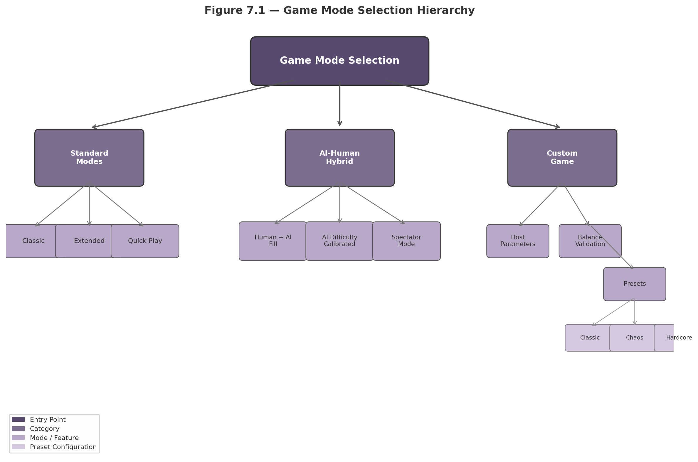
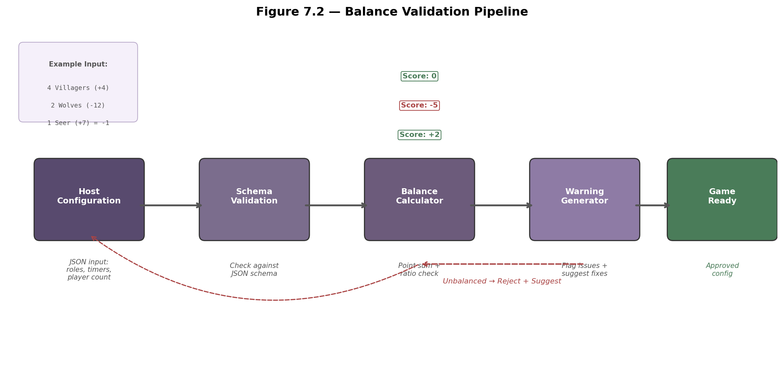
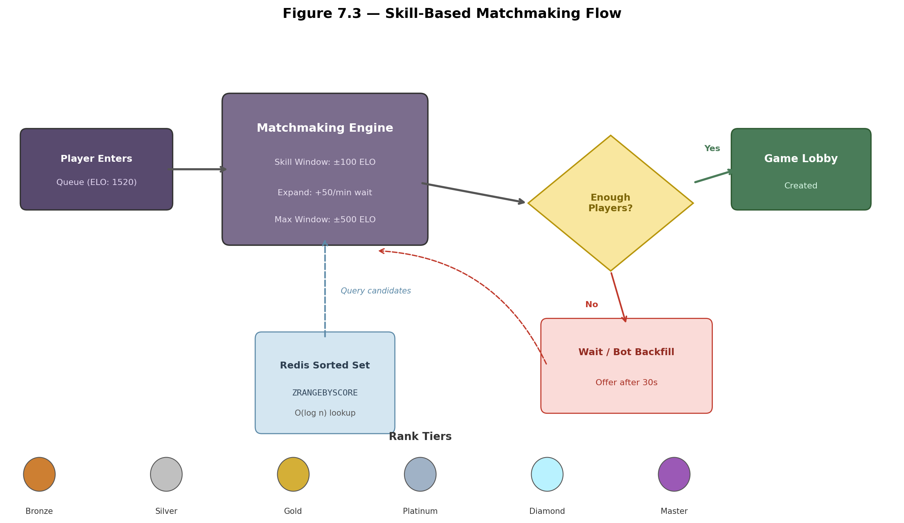
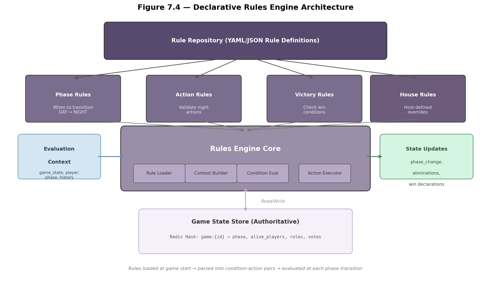

## 7. Game Modes & Customization

The game mode system is the player-facing entry point to all Werewolf gameplay. This chapter specifies three standard modes, AI-human hybrid configurations, a host-customizable framework with real-time balance validation, skill-based matchmaking, and a declarative rules engine. The mode system builds on the 15-state FSM from Chapter 3 and the 12-role roster from Chapter 4, using the point-based balance formula ($b = 1 - |2 \cdot p_{imp} - 1|$) to ensure competitive viability [^14^] [^172^].



### 7.1 Standard Modes

#### 7.1.1 Classic Mode

Classic mode implements the foundational Werewolf experience with fixed roles: Villager, Werewolf, Seer, and Doctor. Player count ranges from 8 to 12, following the established 3:1 villager-to-werewolf ratio [^44^] [^50^]. Phase timers use standard durations (90-second day, 60-second night), with role reveal on death enabled. The 8-player Classic setup (4 Villagers, 1 Seer, 1 Doctor, 2 Werewolves) yields a weight total of $4(+1) + 7 + 3 + 2(-6) = +2$, indicating slight village favor that compensates for beginner-level play [^172^].

#### 7.1.2 Extended Mode

Extended mode adds Hunter, Witch, Mason, Minion, and Alpha Werewolf roles, supporting 10 to 16 players. Multiple simultaneous information axes — Seer investigations, Witch kill-pot reveals, Mason trust networks — create the strategic depth required for competitive play. The 12-player Extended setup (4 Villagers, 1 Seer, 1 Witch, 1 Hunter, 2 Masons, 3 Werewolves, 1 Minion) achieves weight +1, producing near-perfect balance [^172^]. Extended mode enables coordinated wolf team play, protective role chains, and Minion-assisted deception [^220^].

#### 7.1.3 Quick Play

Quick Play compresses the experience into 10- to 15-minute matches. Player count is reduced to 6–8, timers are accelerated (60-second day, 30-second night), and the role set simplifies to Villager, Werewolf, and Seer. Quick Play uses automatic matchmaking with bot backfill to guarantee sub-60-second queues, reducing average game duration from 25–35 minutes to 12–18 minutes [^127^].

**Table 7.1 — Standard Mode Comparison**

| Parameter | Classic | Extended | Quick Play |
|-----------|---------|----------|------------|
| Player Count | 8–12 | 10–16 | 6–8 |
| Role Set | Villager, Werewolf, Seer, Doctor | All 12+ roles | Villager, Werewolf, Seer |
| Day / Night Timer | 90s / 60s | 90s / 60s | 60s / 30s |
| Avg. Duration | 25–35 min | 30–45 min | 12–18 min |
| Balance Weight | +2 (village) | +1 (balanced) | −1 (wolf) |
| Recommended For | Beginners | Intermediate+ | Casual / time-limited |

The Quick Play configuration intentionally introduces a slight wolf advantage because shorter games with less discussion time disproportionately favor the informed minority. In 90,720-game experiments, reduced discussion time shifted the balance index by 0.08–0.12 toward wolves [^14^].

```python
# Game mode configuration constants
MODE_CONFIG = {
    "classic": {
        "min_players": 8, "max_players": 12,
        "roles": {"villager": 4, "seer": 1, "doctor": 1, "werewolf": 2},
        "day_timer_sec": 90, "night_timer_sec": 60,
        "role_reveal_on_death": True, "balance_weight": +2
    },
    "extended": {
        "min_players": 10, "max_players": 16,
        "roles": {"villager": 4, "seer": 1, "witch": 1, "hunter": 1,
                  "mason": 2, "werewolf": 3, "minion": 1},
        "day_timer_sec": 90, "night_timer_sec": 60,
        "role_reveal_on_death": True, "balance_weight": +1
    },
    "quick_play": {
        "min_players": 6, "max_players": 8,
        "roles": {"villager": 3, "seer": 1, "werewolf": 2},
        "day_timer_sec": 60, "night_timer_sec": 30,
        "role_reveal_on_death": True, "balance_weight": -1
    }
}
```

### 7.2 AI-Human Hybrid Modes

#### 7.2.1 Human + AI Fill

When human counts fall below the mode minimum, the system fills remaining slots with AI agents. Rule-based bots serve sub-30-second queue waits; LLM agents (GPT-4o, Claude Sonnet) deploy for longer waits. Research demonstrates that deep behavior models produce substitutes performing similarly to humans of equivalent skill, with players often unable to detect substitutions [^391^]. The system preserves lobby cohesion by matching bot personality profiles to the human ELO bracket.

#### 7.2.2 AI Difficulty Calibration

AI difficulty uses a three-tier system linked to average ELO. Tier 1 (ELO < 1,200) employs rule-based agents with honest play only. Tier 2 (ELO 1,200–1,800) uses standard LLM agents with contextual deception. Tier 3 (ELO > 1,800) deploys GRPO-enhanced agents with full strategic deception and ReCon dual-perspective reasoning [^35^] [^75^]. Tier assignment is computed at match creation, with individual agent difficulty clamped to ±200 points of the lobby average.

**Table 7.2 — AI Difficulty Tier Assignment**

| Tier | ELO Range | Agent Type | LLM Model | Deception Capability |
|------|-----------|------------|-----------|---------------------|
| Tier 1 | < 1,200 | Rule-based + fallback | GPT-4o-mini | None (honest play) |
| Tier 2 | 1,200–1,800 | LLM standard | GPT-4o / Claude Sonnet | Standard (contextual) |
| Tier 3 | > 1,800 | LLM tournament-grade | Claude Sonnet + GRPO | Full (strategic deep deception) |

Werewolf-AgentX research found that per-role ELO tracking produces fairer skill assessment than aggregate ratings, since role asymmetry significantly impacts win probability [^35^].

#### 7.2.3 Spectator Mode

Spectator mode provides read-only observation through four access tiers [^380^]: Public View (same as a living player), Faction View (one faction's perspective), God Mode (full information), and Delayed View (configurable 15–60s delay for anti-stream-sniping). Standard spectators receive Public View; tournament admins receive God Mode.

#### 7.2.4 Hybrid Mode Comparison

**Table 7.3 — AI-Human Hybrid Mode Comparison**

| Mode | Human Players | AI Agents | AI Tier | Duration | Ranked | Role Set |
|------|--------------|-----------|---------|----------|--------|----------|
| Human + AI Fill | 4–7 | 1–8 (backfill) | Auto-calibrated | Standard | No | Classic/Extended |
| AI Training | 0 | 6–16 | All tiers | Accelerated | No | Any |
| Mixed Competitive | 5–9 | 1–3 (fixed) | Lobby average | Standard | Yes | Extended only |
| Spectator | 0 (observer) | N/A | N/A | N/A | N/A | Full visibility |

```python
# AI difficulty calibration algorithm
def assign_ai_tier(lobby_avg_elo: float) -> dict:
    if lobby_avg_elo < 1200:
        return {"tier": 1, "model": "gpt-4o-mini", "deception": False}
    elif lobby_avg_elo < 1800:
        return {"tier": 2, "model": "gpt-4o", "deception": True}
    else:
        return {"tier": 3, "model": "claude-sonnet", 
                "deception": True, "grpo_enhanced": True}

def calibrate_bot_fill(human_count: int, min_players: int,
                       lobby_elo: float) -> list[dict]:
    needed = min_players - human_count
    tier = assign_ai_tier(lobby_elo)
    return [{**tier, "agent_id": f"ai_{i}"} for i in range(needed)]
```

### 7.3 Custom Game Framework

#### 7.3.1 Host-Customizable Parameters

The custom game framework allows hosts to select any subset of 12+ roles, set player count (6–16), adjust timer durations (30–300 seconds), and configure victory conditions. All parameter combinations are validated through the balance pipeline before game start.

#### 7.3.2 Balance Validation

The validator evaluates configurations against three criteria: (1) the Ultimate Werewolf point-sum formula (target −2 to +2) [^172^]; (2) the villager-to-werewolf ratio (2.5:1 to 4.5:1 depending on special role density) [^44^] [^50^]; and (3) information density satisfying the inverse-proportion principle between direct intel and feedback sources [^31^]. Configurations outside the acceptable range generate specific fix suggestions and block game start until resolved.



#### 7.3.3 Preset Configurations

Four validated presets provide one-click balanced configurations, each calibrated using the point-sum formula and tested against 100+ simulated games [^14^].

**Table 7.4 — Preset Configuration Reference**

| Preset | Players | Werewolves | Villagers | Special Roles | Weight | Difficulty |
|--------|---------|------------|-----------|---------------|--------|------------|
| Beginner (Classic) | 8 | 2 | 4 | 1 Seer, 1 Doctor | +2 | Beginner |
| Balanced (Standard) | 12 | 3 | 4 | 1 Seer, 1 Witch, 1 Hunter, 2 Masons | +1 | Intermediate |
| Chaos | 12 | 3 | 2 | Seer, Witch, Hunter, Mason×2, Minion, Alpha Wolf | +3 | Advanced |
| Hardcore | 10 | 3 | 2 | Seer only; reveal OFF | −3 | Expert |
| AI Simulation | 8 | 2 | 4 | 1 Seer, 1 Doctor | +2 | Research |

The Chaos preset maximizes special role density, rewarding players who track cross-role interactions. The Hardcore preset forces pure behavioral deduction through voting pattern analysis and contradiction detection [^96^]. The AI Simulation preset matches the Werewolf-AgentX standard configuration [^35^].

#### 7.3.4 Mode Configuration JSON Schema

All modes share a unified JSON schema validated at configuration time, enforcing role count constraints and cross-field dependencies.

```python
# Balance validation algorithm
ROLE_WEIGHTS = {
    "villager": +1, "seer": +7, "doctor": +3, "hunter": +3,
    "witch": +5, "mason": +2, "werewolf": -6, "alpha_werewolf": -3,
    "minion": -2, "shapeshifter": -4, "serial_killer": -4, "tanner": -1
}

def validate_balance(config: dict) -> dict:
    roles = config["roles"]
    total = sum(roles.values())
    score = sum(ROLE_WEIGHTS.get(r, 0) * c for r, c in roles.items())
    wolves = roles.get("werewolf", 0) + roles.get("alpha_werewolf", 0)
    villagers = total - wolves
    ratio = villagers / max(wolves, 1)
    ratio_adj = -2 if ratio < 2.5 else (+2 if ratio > 4.5 else 0)
    final = score + ratio_adj
    warnings = []
    if final < -2:
        warnings.append(f"Wolf-favored ({final}). Add villagers or reduce wolves.")
    elif final > +2:
        warnings.append(f"Village-favored ({final}). Add wolves or reduce power roles.")
    return {"score": final, "is_balanced": -2 <= final <= +2,
            "warnings": warnings, "villager_wolf_ratio": ratio}
```

```json
{
  "$schema": "https://werewolf.game/config-schema/v1",
  "type": "object",
  "required": ["mode_id", "roles", "timers", "victory_conditions"],
  "properties": {
    "mode_id": {"type": "string", "enum": ["classic", "extended", "quick_play", "custom"]},
    "roles": {
      "type": "object",
      "properties": {
        "villager": {"type": "integer", "minimum": 1, "maximum": 12},
        "werewolf": {"type": "integer", "minimum": 1, "maximum": 6},
        "seer": {"type": "integer", "minimum": 0, "maximum": 1},
        "doctor": {"type": "integer", "minimum": 0, "maximum": 1},
        "witch": {"type": "integer", "minimum": 0, "maximum": 1}
      },
      "required": ["villager", "werewolf"]
    },
    "timers": {
      "type": "object",
      "properties": {
        "day_seconds": {"type": "integer", "minimum": 30, "maximum": 300},
        "night_seconds": {"type": "integer", "minimum": 15, "maximum": 180}
      }
    },
    "victory_conditions": {"type": "string", "enum": ["standard", "parity_only", "no_reveal"]},
    "balance_tolerance": {"type": "integer", "default": 2}
  }
}
```

**Table 7.5 — Custom Game Parameter Bounds**

| Parameter | Minimum | Maximum | Default | Validation Rule |
|-----------|---------|---------|---------|-----------------|
| Player count | 6 | 16 | 8 | Must be ≥ wolves + 2 |
| Day timer | 30s | 300s | 90s | Must be ≥ night timer |
| Night timer | 15s | 180s | 60s | Must allow all actions |
| Werewolves | 1 | 6 | 2 | Ratio ≥ 2.5:1 villagers |
| Special roles | 0 | 8 | 2 | Point sum within tolerance |
| Seer count | 0 | 1 | 1 | Max 1 per game |
| Witch count | 0 | 1 | 0 | Requires ≥1 Werewolf |

### 7.4 Matchmaking & Ranked

#### 7.4.1 Quick Match

Quick Match implements skill-based queueing via Redis Sorted Sets for O(log n) range queries [^429^] [^430^]. The engine establishes an initial ±100 ELO window, expanding at 50 ELO per minute up to ±500 ELO maximum. The target wait time is <60s; after 30s, the system offers bot backfill. Rating updates use the Simple Multiplayer Elo (SME) approach, computing expected scores against average opponent ratings within each faction [^418^].

#### 7.4.2 Ranked Mode

Ranked mode restricts gameplay to Extended mode with standard balance configurations (weight +1, 12-player), ensuring ELO changes reflect skill rather than setup randomness. Ranked requires 8+ human players — no AI backfill. Seasonal resets compress ratings 30% toward the 1,500 baseline every 90 days.

**Table 7.6 — Rank Tier Definitions**

| Tier | ELO Range | K-Factor | Calibration Games | Season Reset |
|------|-----------|----------|-------------------|--------------|
| Bronze | 0–1,199 | 40 | 0–10 | 1,000 |
| Silver | 1,200–1,399 | 32 | 11–30 | 1,250 |
| Gold | 1,400–1,599 | 24 | 31–60 | 1,450 |
| Platinum | 1,600–1,799 | 20 | 61–100 | 1,650 |
| Diamond | 1,800–1,999 | 16 | 100+ | 1,850 |
| Master | 2,000+ | 12 | 200+ | 1,950 |

The decreasing K-factor schedule accelerates convergence for new players while minimizing fluctuation for established Master-tier competitors [^481^]. Ranked mode requires 50 calibration games before public leaderboard appearance.



#### 7.4.3 Per-Role ELO

The system tracks separate ELO values per role category: Overall (all roles), Werewolf (wolf-aligned), Villager (Villager/Mason), and Special (Seer, Doctor, Witch, Hunter). Composite matchmaking scores weight recent role performance at 60% and overall ELO at 40%, ensuring fair opposition when a player receives their weaker role. This addresses the validated problem that strong overall players may underperform in specific roles due to the asymmetry inherent in social deduction [^35^] [^475^].

```python
# Matchmaking engine core
class MatchmakingEngine:
    BASE_WINDOW = 100
    EXPAND_RATE = 50
    MAX_WINDOW = 500
    BOT_FILL_THRESHOLD = 30

    def find_match(self, anchor_id: str, mode: str, region: str):
        queue_key = f"matchmaking:queue:{mode}:{region}"
        player = redis.hgetall(f"matchmaking:player:{anchor_id}")
        skill = int(player["skill_rating"])
        wait_sec = time.time() - float(player["queued_at"])
        window = min(self.BASE_WINDOW + int((wait_sec / 60) * self.EXPAND_RATE),
                     self.MAX_WINDOW)
        # O(log n) range query
        candidates = redis.zrangebyscore(queue_key, skill - window, skill + window)
        candidates = [c for c in candidates if c != anchor_id]
        if len(candidates) >= 7:
            return [anchor_id] + candidates[:7]
        elif len(candidates) >= 5:
            return [anchor_id] + candidates[:5]
        elif wait_sec > self.BOT_FILL_THRESHOLD:
            needed = 7 - len(candidates)
            bots = self.generate_bot_fill(needed, skill)
            return [anchor_id] + candidates + [b["id"] for b in bots]
        return None
```

### 7.5 Rules Engine

#### 7.5.1 Declarative Rule Definitions

The rules engine evaluates all game logic through declarative definitions loaded at game start. Phase Rules govern phase transitions; Action Rules validate night actions against role capabilities (e.g., Doctor cannot protect the same target on consecutive nights [^16^]); Victory Rules check faction win conditions after each elimination; and House Rules enable host-defined overrides. This declarative approach separates game logic from implementation code, enabling new modes without server redeployment.



#### 7.5.2 Rules Engine Evaluation

At each phase transition, the Game Orchestrator invokes the rules engine with the evaluation context — a structured object containing the full game state, player list, current phase, and action history. The engine iterates through loaded rules in priority order (phase → action → victory → house), evaluates conditions against the context, and executes matching actions. Victory rules terminate evaluation immediately upon firing to prevent race conditions.

**Table 7.7 — Rule Type Definitions**

| Rule Type | Condition Example | Action Example | Trigger |
|-----------|-------------------|----------------|---------|
| Phase | All players voted OR timer expired | Transition to NIGHT | Per vote / timer tick |
| Action | Doctor targets Player X | Validate target ≠ previous target | On night action |
| Victory | alive_wolves == 0 | Declare VILLAGER win | After elimination |
| Victory | alive_wolves >= alive_villagers | Declare WEREWOLF win | After elimination |
| House | Host-defined condition | Host-defined override | As specified |

#### 7.5.3 Custom House Rules

Hosts define custom rules through a structured YAML interface. Rules are validated before game start to prevent conflicts — for instance, a rule eliminating all Werewolves on Night 1 is rejected as it violates win condition feasibility. Common house rules include modified victory thresholds, restricted claim rules (no Day 1 claims), and custom timer adjustments. House rules persist in the game configuration and appear in replay event logs.

```python
# Rules engine: loading, evaluation, and execution
class RulesEngine:
    def __init__(self, repository: list[dict]):
        self.rules = self._load_rules(repository)
        self.priority = ["phase", "action", "victory", "house"]

    def _load_rules(self, repo: list[dict]) -> list[Rule]:
        rules = []
        for r in repo:
            rules.append(Rule(
                rule_type=r["type"],
                condition=self._parse_condition(r["condition"]),
                action=self._parse_action(r["action"]),
                priority=self.priority.index(r["type"])
            ))
        return sorted(rules, key=lambda x: x.priority)

    def evaluate(self, ctx: EvaluationContext) -> list[ActionResult]:
        results = []
        for rule in self.rules:
            if rule.condition.evaluate(ctx):
                results.append(rule.action.execute(ctx))
                if rule.rule_type == "victory":
                    break
        return results

    def validate_house_rules(self, rules: list[dict]) -> list[str]:
        errors = []
        for r in rules:
            if r.get("action", {}).get("type") == "instant_win":
                errors.append("Instant win actions not permitted")
            if r.get("condition") == "always_true":
                errors.append("Always-true conditions not permitted")
        return errors
```

The rules engine processes approximately 200–400 rule evaluations per game, with each evaluation completing in under 1 millisecond — sufficiently fast to run synchronously within the game loop. The declarative architecture enables variant modes ("No Reveal," "Wolf Majority," "Cultist Expansion") by loading alternative rule sets without modifying the game server core.
