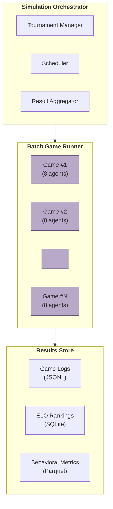
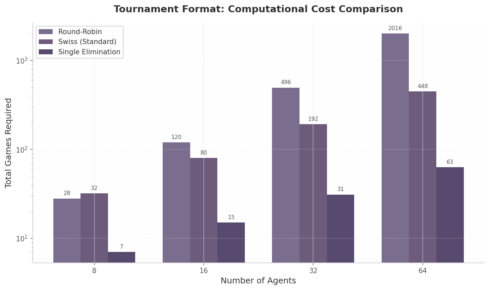
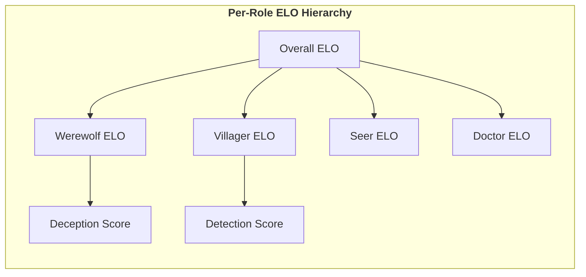
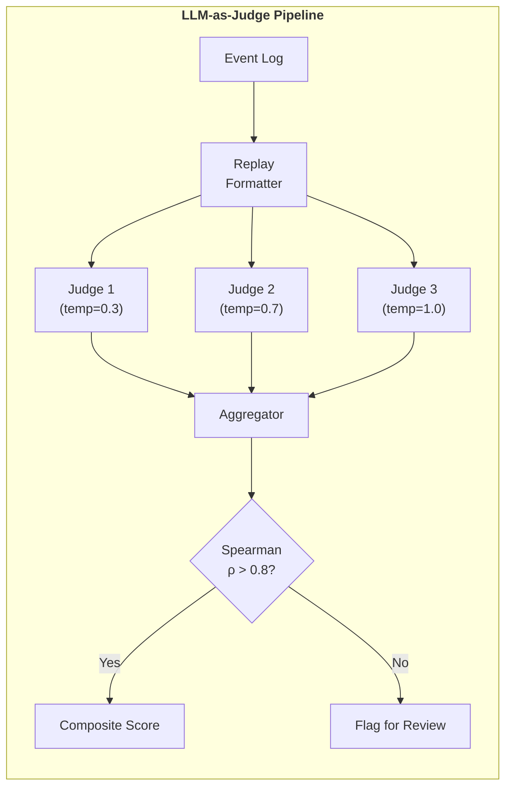
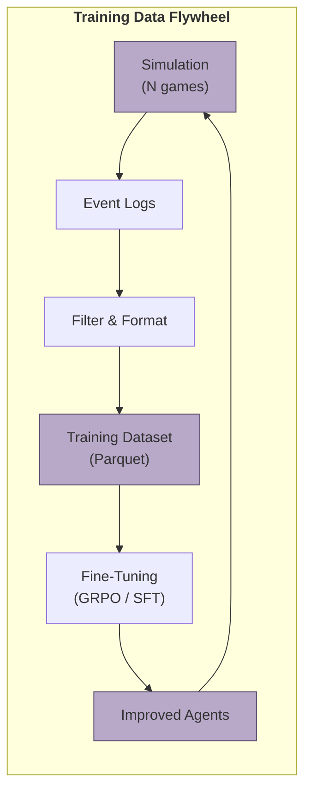

# 8. AI-Only Simulation Mode

The AI-only simulation mode transforms the Werewolf platform from a multiplayer game into a high-throughput social-AI benchmark engine. AI agents of varying architectures — rule-based decision trees, personality-driven trait models, and LLM-powered reasoning systems — compete in accelerated, headless game instances. The simulation produces three outputs: structured event logs for deterministic replay, behavioral metrics for quantitative strategy analysis, and emergent strategy detection reports [^127^][^136^]. This chapter specifies the simulation architecture, tournament formats, ELO-based benchmarking framework, behavioral metrics suite, LLM-as-a-Judge evaluation pipeline, and the training data generation flywheel.

## 8.1 Simulation Architecture

### 8.1.1 Batch Runner

The Simulation Orchestrator manages tournament lifecycles through three subsystems: a Tournament Manager for schedule formatting, a Scheduler for compute assignment, and a Result Aggregator for leaderboard updates [^127^][^462^]. The Batch Game Runner executes independent 8-agent game instances concurrently via direct Python function calls rather than WebSocket messages. Game instances share no mutable state, so horizontal scaling is bounded only by compute. Werewolf Arena reports approximately 50 games per hour on cloud TPU, while GPU-accelerated environments such as Pgx achieve 1.9 million steps per second on a single A100 through vectorized JAX operations [^127^][^462^].

### 8.1.2 Headless Execution

Simulation games execute headlessly: no WebSocket server, no client rendering, no human-facing UI. Agents communicate via direct function calls through an A2A-compatible local interface. Event sourcing (Section 1.4) records every role assignment, night action, statement, vote, and elimination as an immutable event with nanosecond timestamps [^145^][^447^]. The append-only event store enables full game rehydration for debugging, time-travel queries to inspect agent knowledge at specific rounds, branching analysis for counterfactuals, and automatic training data generation.

### 8.1.3 Parallelization

Game instances are embarrassingly parallel. The platform uses `asyncio` to overlap LLM API calls within a single game and multiprocessing across CPU cores. ECS-pattern GPU batch execution achieves 2-3 orders of magnitude speedup over CPU baselines [^463^]. Model routing sends simple decisions (early votes, routine night actions) to GPT-4o-mini or Gemini 2.5 Flash, while complex deception routes to GPT-4o or Claude Sonnet, yielding 40-70% cost savings [^25^].

### 8.1.4 Simulation Parameter Table

| Parameter | Range | Default | Description |
|-----------|-------|---------|-------------|
| `agents_per_game` | 6-15 | 8 | Players per game; must match role set cardinality |
| `games_per_pairing` | 1-50 | 10 | Games per agent matchup with role alternation [^127^] |
| `role_alternation` | true/false | true | Cycle each agent through all roles equally |
| `temperature` | 0.0-2.0 | 0.7 | LLM sampling temperature |
| `batch_size` | 1-10{,}000 | 100 | Parallel game instances |
| `record_level` | full/summary/results-only | full | Event logging granularity |
| `elo_k_factor` | 10-40 | 32 | ELO sensitivity (Section 8.3) |
| `seeds` | [0, N-1] | [0,1,2,3,4] | Reproducibility seeds |

The Game Factory instantiates environments with varying configurations; the Agent Pool registers instances with model configs and personality profiles [^35^]; the Result Sink persists transcripts and outcomes to Parquet for downstream analytics [^136^][^151^].



## 8.2 Tournament Formats

### 8.2.1 Round-Robin

Each agent plays every other agent exactly once using the circle method for balanced scheduling [^446^][^477^]. For $N$ agents, the format requires $N(N-1)/2$ games — 28 games at $N=8$, or 2{,}016 at $N=64$. Werewolf Arena uses this for intra-family evaluation with 10 games per pairing and automatic role alternation [^127^]. Round-robin provides the most statistically robust rankings but its $O(n^2)$ scaling makes it suitable only for pools up to approximately 16 agents.

### 8.2.2 Swiss System

Swiss pairing matches agents by accumulated record rather than exhaustive enumeration. The FIDE Dutch system (effective February 2026) groups players into homogeneous score brackets, then pairs within brackets while enforcing no-repeat constraints and minimizing score differences [^466^]. For 32 agents, Swiss requires 5-6 rounds (80-96 games) versus 496 for round-robin — an 80% compute reduction [^446^][^451^]. Research shows maximum weight matching (Burstein pairing) outperforms Dutch BBP in ranking quality [^468^].

### 8.2.3 Single Elimination

Single elimination determines a winner in $\lceil \log_2 N \rceil$ rounds — only 63 games for 64 agents. However, high variance from a single unlucky role assignment can eliminate strong agents prematurely. The recommended pattern uses Swiss pool play (5-7 rounds) to identify top performers, followed by a single-elimination bracket among the top 4-8 for finals [^452^].

### 8.2.4 Tournament Format Specifications

| Format | Games (N=8) | Games (N=32) | Games (N=64) | Best For | Complexity |
|--------|-------------|-------------|-------------|----------|------------|
| Round-Robin | 28 | 496 | 2{,}016 | Small pools (4-16) [^127^][^477^] | Low |
| Swiss (Standard) | 32 | 192 | 448 | Large pools (16+) [^446^][^451^] | Medium |
| Single Elimination | 7 | 31 | 63 | Quick finals [^446^] | Low |
| Swiss + Bracket | 32+4 | 192+7 | 448+7 | Championship [^452^] | High |



**Figure 8.1** compares total games across formats (logarithmic y-axis). Round-robin scales as $O(n^2)$ and becomes prohibitive beyond 16 agents. The Swiss + Bracket hybrid offers the optimal tradeoff: efficient preliminary ranking followed by decisive finals. For the Werewolf platform, the recommended default is Swiss (5 rounds) for pools of 16+ agents, round-robin for 4-8 agents, and Swiss + Bracket for championships.

## 8.3 AI Benchmarking

### 8.3.1 ELO-Based Ranking

Standard ELO computes expected score as $E_A = \frac{1}{1 + 10^{(R_B - R_A) / 400}}$ and updates as $R'_A = R_A + K \cdot (S_A - E_A)$, where $D = 400$ gives 100:1 odds at an 800-point spread and $K$ controls volatility [^481^][^475^]. For 8-player Werewolf, the system computes faction-average ratings (Werewolf mean versus Villager mean) and applies uniform updates to the winning faction, following Werewolf-AgentX [^35^].

Per-role ELO isolates role-specific competence: an agent may excel at information-gathering (high Seer ELO) while being a poor deceiver (low Werewolf ELO). Overall ELO is a weighted average across roles. Confidence intervals use TrueSkill-style uncertainty: new agents begin with $\sigma = 8.333$ and large $K$-factors; established agents (100+ games) receive smaller $K$-factors [^486^][^487^].

| Games Played | K-Factor | Phase |
|-------------|----------|-------|
| 0-10 | 40 | Calibration |
| 11-30 | 32 | Discovery |
| 31-100 | 20 | Normal |
| 100+ | 16 | Established |

### 8.3.2 Benchmark Metrics

Beyond ELO, six quantitative categories are tracked. Win rate by role measures $P(\text{win} \mid \text{role})$; survival rounds quantifies longevity; vote accuracy tracks correct votes; Traitor Survival Rate ($TSR = |T_{\text{end}}| / |T|$) captures deception fitness [^155^][^156^]; Faithful Correctness Rate ($FCR = \sum \mathbf{1}(V_r^f \in T) / |F|$) measures enemy identification [^155^]; and Deception Effectiveness Score ($DES$) tracks successfully manipulated eliminations [^156^].

### 8.3.3 Benchmark Metrics Table

| Metric | Definition | Target | Frequency |
|--------|-----------|--------|-----------|
| Win Rate by Role | $P(\text{win} \mid \text{role})$ | 45-55% per faction [^490^] | Per game |
| Survival Rounds | $\mathbb{E}[\text{rounds survived}]$ | 4-6 of 8 max | Per game |
| Vote Accuracy | Correct votes / Total votes | $>$50% | Per round |
| TSR | $\|T_{\text{end}}\| / \|T\|$ | 0.6-0.9 [^155^] | Per game |
| FCR | Correct traitor votes / Faithful votes | 0.3-0.6 [^155^] | Per round |
| DES | Manipulated eliminations / Total rounds | 0.4-0.8 [^156^] | Per game |

### 8.3.4 ELO Update Algorithm

The implementation extends team-based ELO with per-role tracking and performance weighting. Individual performance relative to team average modulates the base change, addressing the "good player punished by bad teammates" problem [^475^].

```python
def update_elo_per_role(
    players: list[PlayerRecord],
    winner_faction: str,
    k_base: int = 32,
    role_weights: dict[str, float] = None
) -> dict[str, float]:
    """Update per-role ELO with performance-weighted team adjustment."""
    wolves = [p for p in players if p.faction == 'werewolf']
    villagers = [p for p in players if p.faction == 'villager']

    wolf_avg = sum(p.elo_overall for p in wolves) / len(wolves)
    vill_avg = sum(p.elo_overall for p in villagers) / len(villagers)

    E_wolf = 1.0 / (1.0 + 10.0 ** ((vill_avg - wolf_avg) / 400.0))
    E_vill = 1.0 - E_wolf

    faction_expected = {'werewolf': E_wolf, 'villager': E_vill}
    faction_actual = {
        'werewolf': 1.0 if winner_faction == 'werewolf' else 0.0,
        'villager': 1.0 if winner_faction == 'villager' else 0.0
    }

    for faction_list in [wolves, villagers]:
        if not faction_list:
            continue
        perf_mean = sum(p.performance_score for p in faction_list)
        perf_mean /= len(faction_list)

        for p in faction_list:
            base = k_base * (faction_actual[p.faction] - faction_expected[p.faction])
            ratio = p.performance_score / max(perf_mean, 0.01)
            adj = base * ratio if faction_actual[p.faction] == 1.0 else base / max(ratio, 0.5)

            role = p.role
            weight = (role_weights or {}).get(role, 1.0)
            p.elo_by_role[role] += adj * weight
            p.elo_overall = weighted_average(p.elo_by_role, p.role_games)

    return {p.agent_id: p.elo_overall for p in players}
```



## 8.4 Behavioral Metrics

### 8.4.1 Social Metrics

Social metrics quantify relationship dynamics. Alliance Cohesion Index (ACI) measures voting bloc stability: $ACI = \text{mutual\_votes} / \text{total\_possible\_votes}$. Traitor Agreement Score (TAS) captures Werewolf coordination: $TAS_r = \sum \mathbf{1}(V_r^t = V_r^{\max, T}) / |T|$, where 1.0 indicates perfect bloc unity [^155^]. Werewolf Arena data shows top agents maintain TAS above 0.85 [^127^].

### 8.4.2 Strategic Metrics

Strategic metrics isolate decision quality. Faithful Correctness Rate (FCR) measures signal detection — correct Villager votes targeting Werewolves. Deception Consistency Index ($DCI = 1 - \text{contradictions}/\text{statements}$) tracks narrative coherence. Social Reasoning Index ($\text{SRI} = \text{correct\_inferences}/\text{total\_inferences}$) measures role deduction accuracy.

### 8.4.3 Communication Metrics

Communication metrics characterize language use. Persuasion Measure Index ($\text{PMI} = (\text{votes\_swayed}/N) \cdot (1/\text{utterances})$) quantifies vote-swing efficiency. Deception Production Rate tracks deceptive turns by role, and Brier Score ($\frac{1}{N}\sum(p_i - o_i)^2$) measures suspicion calibration (0 = perfect, 1 = worst) [^136^][^151^].

### 8.4.4 Performance Metrics

Win rate by role targets 45-55% per faction for game balance [^490^]. Longevity Performance Index ($LPI = \text{rounds\_survived} / \text{total\_rounds}$) normalizes survival. Cost per decision (total API spend divided by LLM calls) enables economic comparison of routing strategies.

### 8.4.5 Complete Behavioral Metrics Catalog

| Category | Metric | Formula | Purpose |
|----------|--------|---------|---------|
| Coordination | TAS | $\sum \mathbf{1}(V_r^t = V_r^{\max, T}) / \|T\|$ [^155^] | Werewolf voting bloc unity |
| Coordination | ACI | $\text{mutual\_votes} / \text{total\_possible}$ | Alliance stability |
| Effectiveness | FCR | $\sum \mathbf{1}(V_r^f \in T) / \|F\|$ [^155^] | Correct enemy identification |
| Effectiveness | TSR | $\|T_{\text{end}}\| / \|T\|$ [^156^] | Deception fitness |
| Effectiveness | DES | $\sum \mathbf{1}(E_r \in F \land V_r^t = E_r) / \|R\|$ [^156^] | Manipulation success rate |
| Behavioral | VSF | Vote changes per agent | Position flexibility |
| Behavioral | TNS | Temporal trust correlation [^156^] | Trust consistency |
| Deception | DPR | Deceptive turns / Total turns [^136^] | Deception frequency |
| Deception | Brier Score | $\frac{1}{N}\sum (p_i - o_i)^2$ [^136^] | Suspicion calibration |
| Communication | PMI | $(\text{votes\_swayed}/N) \cdot (1/\text{utterances})$ | Persuasion efficiency |
| Communication | DCI | $1 - (\text{contradictions}/\text{statements})$ | Narrative consistency |
| Performance | LPI | $\text{rounds\_survived} / \text{total\_rounds}$ | Normalized survival |

## 8.5 LLM-as-a-Judge Evaluation

### 8.5.1 Judge Prompt Design

Quantitative metrics capture what agents do; qualitative evaluation assesses how well they reason. The platform uses G-Eval (Microsoft Azure AI, EMNLP 2023), which achieves Spearman correlation of 0.514 on SummEval — outperforming BLEU-4 (0.259) and ROUGE-L (0.244) in human alignment [^140^][^483^]. G-Eval generates auto-CoT evaluation steps, fills scoring forms against rubric dimensions, and applies probability-weighted aggregation [^148^].

### 8.5.2 Evaluation Dimensions

| Dimension | Weight | Criteria | Description |
|-----------|--------|----------|-------------|
| Strategy Soundness | 25% | Coherence (1-5), Validity (1-5) | Reasoning correctness, valid deductions |
| Social Manipulation | 25% | Persuasiveness (1-5), Evidence (1-5) | Ability to convince, argument strength |
| Consistency | 20% | Action-speech alignment (1-5) | Stated beliefs vs. actions |
| Creativity | 15% | Novelty (1-5), Adaptability (1-5) | Unconventional tactics, recovery |
| Fairness | 15% | Sportiveness (1-5) | Absence of meta-exploitation |

The composite score is $\text{Score} = 0.25S + 0.25M + 0.20C + 0.15Cr + 0.15F$ over the range [1.0, 5.0].

### 8.5.3 Consistency Checking

Judge variance is mitigated through three independent evaluation passes at temperatures 0.3, 0.7, and 1.0. Inter-rater reliability uses Spearman correlation; a minimum $\rho > 0.8$ between any two runs is required for acceptance [^140^][^142^]. Failing scores trigger additional passes until consistency is achieved or the result is flagged for human review. Bias mitigation includes option order randomization (position bias), token-count normalization (verbosity bias), and cross-model evaluation where the judge model differs from player models (self-preference bias) [^140^].

### 8.5.4 LLM-as-Judge Rubric and Prompt Template

```python
JUDGE_PROMPT_TEMPLATE = """
You are an expert game analyst evaluating a Werewolf agent's performance.

## Game Replay Context
{game_transcript}

## Agent Under Evaluation
Agent: {agent_id} | Role: {role} | Faction: {faction}

Evaluate across 5 dimensions (1=poor, 5=excellent). Provide 2-3 sentence
justification per dimension, then assign a score.

1. Strategy Soundness (25%): Logical deductions, valid plans, sound night actions
2. Social Manipulation (25%): Persuasion quality, statement crafting, vote influence
3. Consistency (20%): Action-speech alignment, narrative coherence
4. Creativity (15%): Novel tactics, adaptation to unexpected events
5. Fairness (15%): Rule compliance, absence of meta-gaming

Output JSON:
{{
  "strategy_soundness": {{"score": int, "justification": "str"}},
  "social_manipulation": {{"score": int, "justification": "str"}},
  "consistency": {{"score": int, "justification": "str"}},
  "creativity": {{"score": int, "justification": "str"}},
  "fairness": {{"score": int, "justification": "str"}},
  "composite_score": float,
  "flagged_for_review": bool
}}
"""

def evaluate_with_consistency_check(
    game_transcript: str,
    agent_id: str,
    judge_model: str = "gpt-4o",
    min_spearman: float = 0.80
) -> dict:
    """Run LLM-as-Judge with inter-rater consistency validation."""
    evaluations = []
    for temp in [0.3, 0.7, 1.0]:
        prompt = JUDGE_PROMPT_TEMPLATE.format(
            game_transcript=game_transcript,
            agent_id=agent_id,
            role=get_role(agent_id, game_transcript),
            faction=get_faction(agent_id, game_transcript)
        )
        evaluations.append(llm_judge(prompt, model=judge_model, temperature=temp))

    for i in range(len(evaluations)):
        for j in range(i + 1, len(evaluations)):
            if spearman(evaluations[i], evaluations[j]) >= min_spearman:
                return aggregate_evaluations(evaluations)

    return {**aggregate_evaluations(evaluations),
            "flagged_for_review": True}
```



## 8.6 Training Data Generation

### 8.6.1 Event Log to Training Data

Every simulation produces a structured event log that feeds training dataset construction. The pipeline filters decision-relevant events (role assignments, night results, statements, vote outcomes, eliminations) and formats them as instruction-response pairs. Each example contains the game state visible to an agent at a decision point (input), the action taken (output), and the eventual faction outcome weighted by contribution timing (reward label) [^35^].

### 8.6.2 Dataset Schema

| Field | Type | Description |
|-------|------|-------------|
| `game_state` | JSON | Observable state at decision point |
| `agent_action` | JSON | Reasoning + statement + action |
| `reward_value` | float | Outcome signal [-1, +1] with contribution weighting |
| `role_context` | enum | Agent's role for role-conditioned training |

The `reward_value` is a product of faction outcome (+1 win, -1 loss), temporal weight (earlier critical actions receive higher weights), and role-specific adjustment accounting for different base win rates per role.

### 8.6.3 Data Flywheel

Simulation creates a self-reinforcing improvement cycle: simulation generates games → event logs convert to training datasets → fine-tuning (GRPO or SFT) improves agents → better agents produce higher-quality simulations. GRPO training for persuasive agents has demonstrated strong results across Werewolf, Avalon, and ONUW [^35^]. Prompt caching reduces data generation costs by 59-90%, and context compaction cuts per-turn tokens by 50-70%, making large-scale generation viable [^24^][^25^].



### 8.6.4 Training Data Export Code

The export pipeline converts events into instruction-response pairs for supervised fine-tuning and preference-based RL. The `reward_value` applies temporal discounting: early-game actions influencing trajectory receive higher weight than late-game actions with limited strategic impact.

```python
def export_training_data(
    game_events: list[GameEvent],
    output_path: str,
    temporal_discount: float = 0.95
) -> int:
    """Convert game event log into instruction-response training pairs."""
    examples = []
    winner = extract_winner(game_events)
    max_round = max((e.round_num for e in game_events if e.round_num), default=1)

    for event in game_events:
        if event.event_type not in DECISION_EVENTS:
            continue

        visible = build_visible_state(game_events, event.player_id, event.sequence_num)

        faction_win = 1.0 if winner.get(event.faction) == 'won' else -1.0
        timing = temporal_discount ** (event.round_num / max(max_round, 1))
        role_adj = ROLE_BASELINE_REWARD.get(event.role, 0.0)
        reward = faction_win * timing + role_adj

        examples.append({
            'game_state': json.dumps(visible),
            'agent_action': json.dumps({
                'reasoning': event.payload.get('reasoning', ''),
                'public_statement': event.payload.get('public_statement', ''),
                'action': event.payload.get('action', '')
            }),
            'reward_value': round(reward, 4),
            'role_context': event.role,
            'game_id': event.game_id
        })

    pd.DataFrame(examples).to_parquet(output_path, compression='zstd')
    return len(examples)
```

The flywheel operates continuously: as tournaments run, the export pipeline appends examples to a growing dataset. Periodic fine-tuning (weekly or triggered by ELO stagnation) produces improved checkpoints that replace older models in the simulation pool. This closed loop ensures autonomous improvement, with each agent generation producing more strategically sophisticated games. The combination of ELO rankings, behavioral metrics, LLM-as-a-Judge evaluation, and automated training data generation positions the platform as a comprehensive benchmark for social AI [^35^][^127^][^136^].
