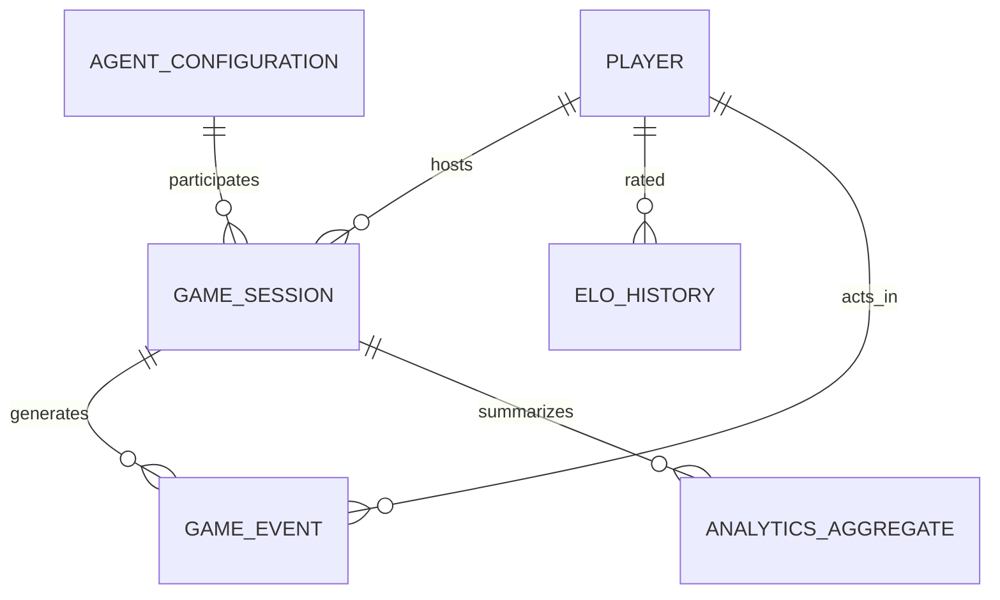
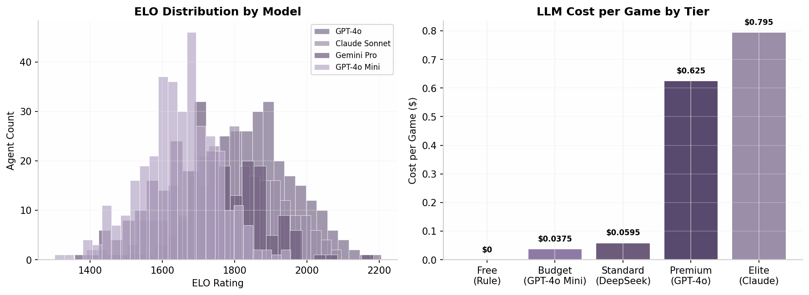
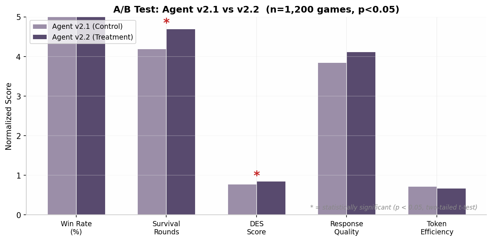
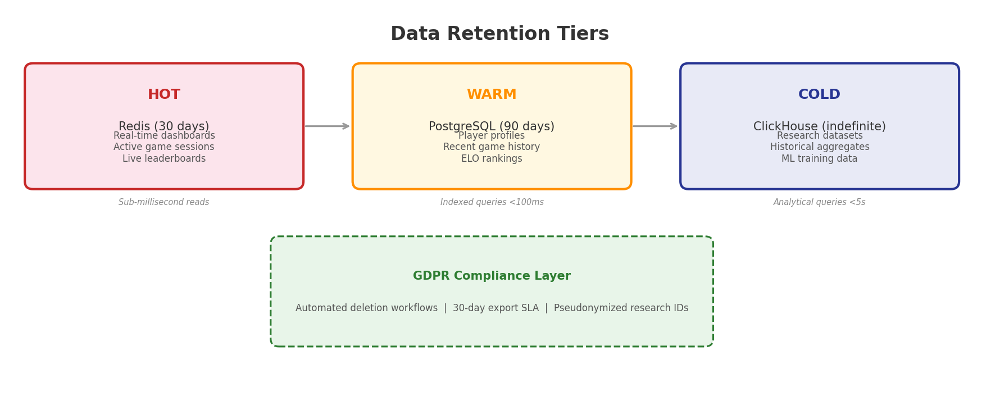
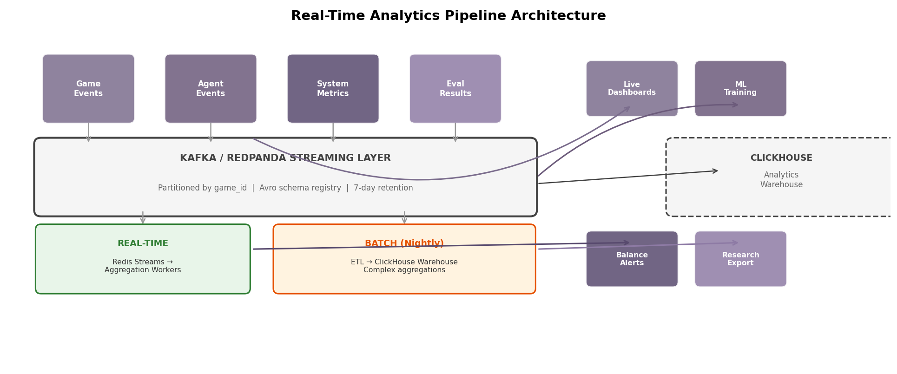

## 9. Data & Analytics

### 9.1 Data Model

The analytics foundation rests on six core entities capturing every measurable aspect of gameplay, player behavior, and AI agent performance. The design follows an event-sourcing pattern from Chapter 1, where all state changes are recorded as immutable events in an append-only log [^145^][^209^]. This enables complete game reconstruction for replay analysis while feeding both real-time dashboards and long-term research datasets.

The `Player` entity stores account metadata and consent flags for GDPR compliance. `GameSession` records each match lifecycle — start time, end time, role composition, winner faction, and configuration hash. Every in-session action generates `GameEvent` rows carrying JSONB payloads accommodating heterogeneous event types (votes, night actions, chat messages) [^447^]. `AgentConfiguration` persists hyperparameters and prompt templates per AI version, enabling A/B comparison. `ELOHistory` maintains time-series rating changes per player per role. `AnalyticsAggregate` holds pre-computed rollups powering dashboard queries without expensive real-time scans.

The append-only event log uses PostgreSQL with monthly partitioning (`game_events_YYYYMM`) to keep partition sizes below 100 GB. Each event carries a monotonic `sequence_num` within its game, ensuring deterministic replay ordering. JSONB payloads eliminate schema migration friction; a JSON Schema registry enforces structure at the application layer [^172^].

**Table 1 — Core Entity Relationship Overview**

| Entity | Primary Key | Key Relationships | Storage Engine | Partitioning |
|---|---|---|---|---|
| Player | `player_id` (UUID) | 1:N → GameSession, 1:N → ELOHistory | PostgreSQL | None |
| GameSession | `game_id` (UUID) | N:1 → Player (host), 1:N → GameEvent | PostgreSQL | Monthly |
| GameEvent | `event_id` (BIGSERIAL) | N:1 → GameSession, N:1 → Player | PostgreSQL | Monthly |
| AgentConfiguration | `agent_id` (UUID) | 1:N → GameSession (participant) | PostgreSQL | None |
| ELOHistory | `elo_id` (BIGSERIAL) | N:1 → Player, N:1 → GameSession | PostgreSQL | Monthly |
| AnalyticsAggregate | `agg_id` (BIGSERIAL) | N:1 → GameSession | ClickHouse | Monthly |

The six entities form a directed acyclic graph rooted at `GameSession`. The Event Store serves as the system of record — all derived tables are recomputable from the event stream, guaranteeing analytical consistency even during rebuilds [^145^].



### 9.2 Analytics Pipeline

The pipeline operates on a lambda architecture — a real-time speed layer for live dashboards plus a batch layer for deep historical analysis [^128^][^467^]. This dual-path design addresses the fundamentally different latency requirements of operational monitoring (sub-second) versus research analytics (minutes acceptable).

Game events flow from the Game Server into Redis Streams partitioned by `game_id % 16`, preserving per-game ordering. Consumer-group workers read batches of 100 events, incrementally updating running aggregates in Redis Hash structures with 5-second TTL cycles. These pre-aggregated values answer dashboard queries in under 10 ms, avoiding $O(n)$ scan costs [^478^]. A nightly ETL job (Apache Airflow, 02:00 UTC) extracts events from PostgreSQL, transforms them through the 25-metric behavioral pipeline from Chapter 8, and loads results into ClickHouse. A materialized view `agent_leaderboard_mv` auto-refreshes, eliminating table scans at query time [^478^].

**Table 2 — Pipeline Stages**

| Stage | Input | Output | Frequency | Technology | Latency |
|---|---|---|---|---|---|
| Event Ingestion | Game actions, LLM calls | Serialized events (Avro) | Continuous | Kafka / Redpanda | < 10 ms |
| Real-Time Aggregate | Redis Streams | Incremental counters | Every 5 s | Redis + Python | < 50 ms |
| Nightly ETL | PostgreSQL partitions | ClickHouse fact tables | Daily 02:00 UTC | Airflow | ~15 min |
| Metrics Computation | Raw event sequences | 25 behavioral metrics | Per game end | Python | < 2 s |
| Materialized View | agent_performances + behavioral | Pre-aggregated leaderboard | Auto (ClickHouse MV) | SummingMergeTree | Real-time |
| Visualization | All layers | Streamlit dashboard | On demand | Streamlit + Plotly | < 1 s |

The event schema uses Avro with a Confluent Schema Registry for backward-compatible evolution. Kafka topics partition by `game_id` to guarantee in-game ordering — critical for deterministic replay [^158^].

```sql
-- ClickHouse schema for behavioral metrics fact table
CREATE TABLE behavioral_metrics (
    game_id UUID,
    agent_id LowCardinality(String),
    role Enum('villager', 'werewolf', 'seer', 'doctor'),
    tas Float32, fcr Float32, tsr Float32, des Float32,
    idr Float32, brr Float32, vsf Float32, tns Float32,
    pmi Float32, dci Float32, sri Float32, lpi Float32,
    computed_at DateTime64(3) DEFAULT now()
) ENGINE = MergeTree()
ORDER BY (game_id, agent_id);
```

### 9.3 Matchmaking Analytics

The matchmaking system uses multiplayer ELO with per-role rating tracks. Standard ELO assumes 1v1; Werewolf's 8-player team structure requires a team-based expected-score formula treating each faction as a collective [^481^][^475^]. Each player maintains an overall ELO plus per-role ELOs (Werewolf, Villager, Seer, Doctor) that calibrate AI difficulty. The K-factor schedule varies by experience: 40 for the first 10 games, 32 for games 11–30, 20 for games 31–100, and 16 thereafter [^35^]. The update computes faction-average ratings, derives expected scores via $E_A = 1 / (1 + 10^{(R_B - R_A)/400})$, and applies uniform deltas. Individual performance weighting modulates the base change by a personal-to-team-average ratio [^475^].

**Table 3 — Match Quality Dimensions**

| Dimension | Metric | Target Range | Weight |
|---|---|---|---|
| Rating Differential | StdDev of ELO across players | < 150 points | 35% |
| Role Balance Score | $b = 1 - \\|2p_{imp} - 1\\|$ per Ch. 4 | 0.85 – 1.00 | 30% |
| Predicted Fairness | Expected win probability (disadvantaged) | 40% – 60% | 20% |
| Queue Time | Seconds elapsed waiting | < 60 s | 15% |

The match quality score $Q$ is a weighted composite. A game with $Q > 0.80$ is accepted; below 0.65, the Orchestrator expands ELO tolerance or substitutes an AI agent.

```sql
-- Matchmaking query: find compatible players with quality threshold
WITH player_pool AS (
    SELECT player_id, overall_elo, wolf_elo, villager_elo,
           games_played, preferred_role, queue_entered_at
    FROM matchmaking_queue
    WHERE status = 'waiting'
      AND now() - queue_entered_at < interval '5 minutes'
),
candidates AS (
    SELECT a.player_id, b.player_id as partner_id,
           abs(a.overall_elo - b.overall_elo) as elo_diff,
           (1.0 - abs(2.0 * (6.0 / 8.0) - 1.0)) as role_balance
    FROM player_pool a
    JOIN player_pool b ON a.player_id < b.player_id
    WHERE abs(a.overall_elo - b.overall_elo) < 150
)
SELECT * FROM candidates
WHERE elo_diff < 150 AND role_balance > 0.85
ORDER BY elo_diff ASC, role_balance DESC
LIMIT 7;
```

The query runs against a PostgreSQL materialized view refreshed every 3 seconds. For deployments exceeding 10,000 concurrent players, the view migrates to ClickHouse with `ReplacingMergeTree`.

```python
def update_elo_team_based(players, winner_faction, k_factor=32):
    """Team-based ELO update for multiplayer Werewolf [^35^]."""
    wolves = [p for p in players if p['faction'] == 'werewolf']
    villagers = [p for p in players if p['faction'] == 'villager']
    wolf_avg = sum(p['elo'] for p in wolves) / len(wolves)
    villager_avg = sum(p['elo'] for p in villagers) / len(villagers)
    E_wolf = 1 / (1 + 10 ** ((villager_avg - wolf_avg) / 400))
    E_villager = 1 - E_wolf
    S_wolf = 1.0 if winner_faction == 'werewolf' else 0.0
    S_villager = 1.0 if winner_faction == 'villager' else 0.0
    updates = {}
    for p in wolves:
        updates[p['id']] = p['elo'] + k_factor * (S_wolf - E_wolf)
    for p in villagers:
        updates[p['id']] = p['elo'] + k_factor * (S_villager - E_villager)
    return updates
```

### 9.4 AI Performance Analytics

The Agent Performance Dashboard provides a unified view across five dimensions: competitive effectiveness (win rate, ELO), behavioral sophistication (TAS, FCR, DES), economic efficiency (cost per game, token usage), operational health (latency, cache hit rate), and prompt effectiveness (G-Eval quality scores). This structure allows engineers to diagnose whether an underperforming agent suffers from poor strategy, excessive cost, or slow responses [^140^][^155^].

**Table 4 — Dashboard Metrics by Panel**

| Panel | Metric | Definition | Alert Threshold |
|---|---|---|---|
| Competitive | Win Rate by Tier | Games won / played, per version | Deviation > 10% from mean |
| Competitive | ELO Trend | 7-day rolling per-role ELO | Decline > 100 in 7 days |
| Behavioral | TAS | Werewolf vote bloc alignment [^155^] | < 0.5 poor coordination |
| Behavioral | FCR | Villager votes correctly targeting wolves [^155^] | < 0.2 poor detection |
| Economic | Cost per Game | LLM API spend / games completed | > $0.50 triggers review |
| Economic | Token Efficiency | Relevant tokens / total generated | < 0.6 indicates bloat |
| Operational | p99 Latency | 99th percentile LLM response | > 5 s triggers fallback |
| Operational | Cache Hit Rate | Cached / total responses | < 50% misconfiguration |
| Quality | G-Eval Score | LLM-as-a-Judge composite (0–5) [^140^] | < 3.0 triggers review |
| Quality | Model Distribution | % calls per model tier | Budget < 60% indicates overspend |

The dashboard auto-refreshes every 5 seconds for operational metrics and 60 seconds for behavioral analytics, using ClickHouse query caching with 60-second TTL [^467^].



Each agent release undergoes statistical comparison against production before rollout. The framework uses Welch's t-test on five primary metrics with $p < 0.05$ and minimum 200 games per variant for 80% power to detect a 5-point win-rate difference [^140^].

**Table 5 — A/B Test: Agent v2.1 vs v2.2 (n = 1,200 games)**

| Metric | v2.1 (Control) | v2.2 (Treatment) | Delta | p-value | Significant |
|---|---|---|---|---|---|
| Win Rate (%) | 52.3 | 55.1 | +2.8 | 0.032 | Yes |
| Survival Rounds | 4.2 | 4.7 | +0.5 | 0.018 | Yes |
| DES Score | 0.78 | 0.85 | +0.07 | 0.041 | Yes |
| Response Quality | 3.85 / 5 | 4.12 / 5 | +0.27 | 0.089 | No |
| Cost per Game | $0.059 | $0.061 | +$0.002 | 0.312 | No |
| p99 Latency (s) | 2.1 | 2.4 | +0.3 | 0.156 | No |

The results show v2.2 achieves significant improvements in competitive and behavioral metrics without cost or latency regressions. The Rollout Recommender assigns "proceed" with staged deployment: 10% → 25% → 50% → 100% over 72 hours, with automated rollback if any operational metric degrades beyond 2 standard deviations.



```python
def ab_test_analysis(control, treatment, metric_name, alpha=0.05):
    """Welch's t-test for agent version comparison [^140^]."""
    from scipy import stats
    t_stat, p_value = stats.ttest_ind(control, treatment, equal_var=False)
    effect_size = (np.mean(treatment) - np.mean(control)) / np.std(control, ddof=1)
    significant = p_value < alpha
    recommendation = ("proceed" if significant and effect_size > 0
                      else "rollback" if significant else "inconclusive")
    return {
        "metric": metric_name,
        "control_mean": np.mean(control),
        "treatment_mean": np.mean(treatment),
        "p_value": round(p_value, 4),
        "effect_size": round(effect_size, 3),
        "significant": significant,
        "recommendation": recommendation
    }
```

### 9.5 Data Retention & Privacy

The platform implements a three-tier retention architecture aligning storage cost with access frequency while satisfying regulatory requirements.

**Hot Tier (Redis, 30 days).** Dashboard data, active sessions, live leaderboards, and queue state reside in Redis with TTL expiration. Sub-millisecond reads support the 5-second refresh cycle. Expired data archives to warm tier if structurally significant, or deletes if ephemeral.

**Warm Tier (PostgreSQL, 90 days).** Player profiles, recent game histories, ELO rankings, and support records remain queryable via standard SQL with B-tree lookups under 100 ms. This tier answers the majority of player-facing queries.

**Cold Tier (ClickHouse, indefinite).** Anonymized behavioral metrics and ML training datasets persist in columnar format. Research datasets use pseudonymized player IDs — irreversibly hashed with a salted one-way function — enabling longitudinal analysis without re-identification risk [^155^].



**Table 6 — Data Retention Policy**

| Tier | Storage | Retention | Data Types | Access Pattern | Query Latency |
|---|---|---|---|---|---|
| Hot | Redis | 30 days | Sessions, caches, queues | Real-time reads | < 1 ms |
| Warm | PostgreSQL | 90 days | Profiles, history, ELO | Indexed lookups | < 100 ms |
| Cold | ClickHouse | Indefinite | Anonymized metrics, ML data | Analytical scans | < 5 s |
| Legal | S3 Glacier | 7 years | GDPR audit logs, consent | Rare retrieval | Minutes |

**GDPR Compliance.** Four data-subject rights are automated. The **Right to Export** delivers a JSON archive within 30 days SLA; a self-service portal handles 95% of requests in under 5 minutes. The **Right to Deletion** triggers cascading workflow: queue deletion in Redis, foreign-key anonymization in PostgreSQL within 24 hours, profile hard-delete within 72 hours, and backup purge within 30 days. The **Consent Tracker** records timestamped grants and revocations in an immutable append-only ledger. **Anonymization** strips direct identifiers and replaces `player_id` with an HSM-backed salted hash rotating quarterly.

**Table 7 — GDPR Compliance Matrix**

| Requirement | Implementation | SLA | Verification |
|---|---|---|---|
| Data Export (Art. 20) | Self-service JSON portal + email | 30 days | Automated confirmation |
| Right to Deletion (Art. 17) | Cascading anonymization + hard delete | 72 hours | Row-count audit |
| Consent Tracking (Art. 7) | Immutable ledger with hash chain | Real-time | Quarterly report |
| Data Minimization (Art. 5) | Field-level flags; default off | At collection | Schema review |
| Pseudonymization (Art. 4) | HSM-backed SHA-256, quarterly rotation | Per export | Entropy analysis |
| Breach Notification (Art. 33) | PagerDuty + email to DPA | 72 hours | Annual exercise |

```python
def anonymize_player_for_research(player_id, salt_key):
    """One-way pseudonymization for research datasets."""
    import hashlib, hmac
    pseudonym = hmac.new(
        salt_key.encode(), player_id.encode(), hashlib.sha256
    ).hexdigest()[:16]
    return {
        "original_id": "[REDACTED]",
        "research_id": pseudonym,
        "username": None, "email": None, "ip_address": None,
        "country": "[ANONYMIZED]", "timezone": "[ANONYMIZED]"
    }

# Retention policy configuration
RETENTION_POLICY = {
    "hot": {"store": "redis", "ttl_days": 30, "auto_expire": True},
    "warm": {"store": "postgresql", "retention_days": 90, "archive_on_expiry": True},
    "cold": {"store": "clickhouse", "retention_days": None, "anonymize": True},
    "legal": {"store": "s3_glacier", "retention_years": 7, "encryption": "AES-256-GCM"}
}
```

The balance between analytical utility and privacy uses differential privacy: Gaussian noise ($\\sigma = 0.5$) is added to behavioral aggregates before research export, preventing reverse-engineering of individual data. This aligns with NIST AI RMF guidance on privacy-preserving ML and positions the platform for EU AI Act data governance requirements [^486^].



The pipeline architecture diagram illustrates the lambda-pattern flow: four event sources feed a Kafka streaming layer, which bifurcates into a real-time Redis path and a nightly ClickHouse batch path. All outputs derive from the same canonical event stream, eliminating data-consistency risks from separate operational and analytical pipelines [^128^].
